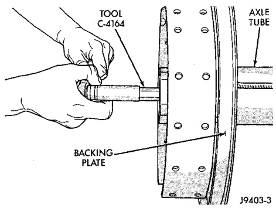
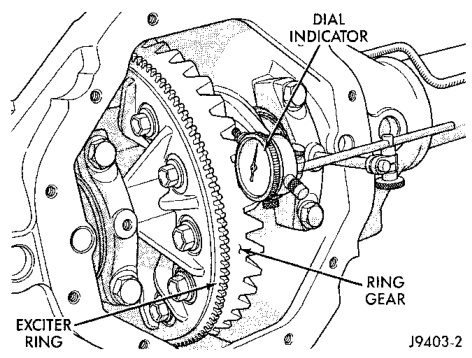

# DIFFERENTIAL AND DRIVELINE 3-82

## ADJUSTMENTS (Continued)

(1) Use Wrench C-4164 to adjust each threaded adjuster inward until the differential bearing free-play is eliminated (Fig. 58). Allow some ring gear backlash (approximately 0.01 inch/0.25 mm) between the ring and pinion gear. Seat the bearing cups with the procedure described above.

*Fig. 58 Threaded Adjuster Tool*
- Tool C-4164
- Adjuster
- Backing Plate

J9403-3

(2) Install dial indicator and position the plunger against the drive side of a ring gear tooth (Fig. 59). Measure the backlash at 4 positions (90 degrees apart) around the ring gear. Locate and mark the area of minimum backlash.

(3) Rotate the ring gear to the position of the least backlash. Mark the gear so that all future backlash measurements will be taken with the same gear teeth meshed.

*Fig. 59 Ring Gear Backlash Measurement*
- Dial Indicator
- Exciter Ring
- Ring Gear

J9403-2

(4) Loosen the right-side, tighten the left-side threaded adjuster. Obtain backlash of 0.003 to 0.004 inch (0.076 to 0.102 mm) with each adjuster tightened to 14 N·m (10 ft. lbs.). Seat the bearing cups with the procedure described above.

(5) Tighten the differential bearing cap bolts to 136 N·m (100 ft. lbs.).

(6) Tighten the right-side threaded adjuster to 102 N·m (75 ft. lbs.). Seat the bearing cups with the procedure described above. Continue to tighten the right-side adjuster and seat bearing cups until the torque remains constant at 102 N·m (75 ft. lbs.)

(7) Measure the ring gear backlash. The range of backlash is 0.006 to 0.008 inch (0.15 to 0.203 mm).

(8) Continue increasing the torque at the right-side threaded adjuster until the specified backlash is obtained.

**NOTE:** The left-side threaded adjuster torque should have approximately 102 N·m (75 ft. lbs.). If the torque is considerably less, the complete adjustment procedure must be repeated.

(9) Tighten the left-side threaded adjuster until 102 N·m (75 ft. lbs.) torque is indicated. Seat the bearing rollers with the procedure described above. Do this until the torque remains constant.

(10) Install the threaded adjuster locks and tighten the lock screws to 10 N·m (90 in. lbs.).

After the proper backlash is achieved, perform the Gear Contact Analysis procedure.

---

### GEAR CONTACT PATTERN ANALYSIS

The ring and pinion gear teeth contact patterns will show if the pinion gear depth is correct in the axle housing. It will also show if the ring gear backlash has been adjusted correctly. The backlash can be adjusted within specifications to achieve desired tooth contact patterns.

(1) Apply a thin coat of hydrated ferric oxide, or equivalent, to the drive and coast side of the ring gear teeth.

(2) Wrap, twist, and hold a shop towel around the pinion yoke to increase the turning resistance of the pinion gear. This will provide a more distinct contact pattern.

(3) Using a boxed end wrench on a ring gear bolt, Rotate the differential case one complete revolution in both directions while a load is being applied from shop towel.

The areas on the ring gear teeth with the greatest degree of contact against the pinion gear teeth will squeegee the compound to the areas with the least amount of contact. Note and compare patterns on the ring gear teeth to Gear Tooth Contact Patterns chart (Fig. 60) and adjust pinion depth and gear backlash as necessary.
