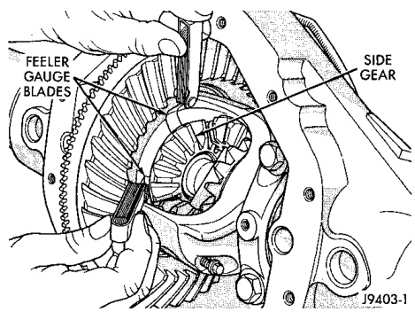

# DIFFERENTIAL AND DRIVELINE 3-84

## ADJUSTMENTS (Continued)

### SIDE GEAR CLEARANCE

When measuring side gear clearance, check each gear independently. If it is necessary to replace a side gear, replace both gears as a matched set.

(1) Install the axle shafts and C-clip locks and pinion mate shaft.

(2) Measure each side gear clearance. Insert a matched pair of feeler gauge blades between the gear and differential housing on opposite sides of the hub (Fig. 61).

*Fig. 61 Side Gear Clearance Measurement*
- Feeler Gauge
- Side Gear

J9403-1

(3) If side gear clearance is no more than 0.005 inch: Determine if the shaft is contacting the pinion gear mate shaft. Do not remove the feeler gauges, inspect the axle shaft with the feeler gauge inserted behind the side gear. If the end of the axle shaft is not contacting the pinion gear mate shaft, the side gear clearance is acceptable.

(4) If clearance is more than 0.005 inch (axle shaft not contacting mate shaft), record the side gear clearance. Remove the thrust washer and measure its thickness with a micrometer. Add the washer thickness to the recorded side gear clearance. The sum of gear clearance and washer thickness will determine required thickness of replacement thrust washer (Fig. 62).

*Fig. 62 Side Gear Calculations*

| Calculation | Value |
|-------------|-------|
| Side Gear Clearance | 0.007 |
| Thrust Washer Thickness | + 0.033 |
| **Total** | **0.040** |
| | |
| Total | 0.040 |
| Replacement Washer Thickness | - 0.037 |
| **New Side Gear Clearance** | **0.003** |

J9203-31

In some cases, the end of the axle shaft will move and contact the mate shaft when the feeler gauge is inserted. The C-clip lock is preventing the side gear from sliding on the axle shaft.

(5) If there is no side gear clearance, remove the C-clip lock from the axle shaft. Use a micrometer to measure the thrust washer thickness. Record the thickness and re-install the thrust washer. Assemble the differential case without the C-clip lock installed and re-measure the side gear clearance.

(6) Compare both clearance measurements. If the difference is less than 0.012 inch (0.305 mm), add clearance recorded when the C-clip lock was installed to thrust washer thickness measured. The sum will determine the required thickness of the replacement thrust washer.

(7) If clearance is 0.012 inch (0.305 mm) or greater, both side gears must be replaced (matched set) and the clearance measurements repeated.

(8) If clearance (above) continues to be 0.012 inch (0.305 mm) or greater, the case must be replaced.

---

## SPECIFICATIONS

### 9 1/4 INCH AXLE

| DESCRIPTION | SPEC. |
|-------------|-------|
| Axle Type | Semi-floating, hypoid |
| Lubricant | SAE 80W-90 |
| Lube Capacity | 2.32 L (4.9 pts.) |
| Trac-lok Additive | 148 ml (5 oz.) |
| Axle Ratio | 3.21, 3.55, 3.92 |
| **Differential** | |
| Case Clearance | 0.12 mm (0.005 in.) |
| Case Flange Runout | 0.076 mm (0.003 in.) |
| **Ring Gear** | |
| Diameter | 23.50 cm (9.25 in.) |
| Backlash | 0.12-0.20 mm (0.005-0.008 in.) |
| Runout | 0.12 mm (0.005 in.) |
| **Pinion Bearing Preload** | |
| Original | 1-2 N·m (10-20 in. lbs.) |
| New | 2-5 N·m (15-35 in. lbs.) |

---

## TORQUE

| DESCRIPTION | TORQUE |
|-------------|--------|
| Bolt, Diff. cover | 41 N·m (30 ft. lbs.) |
| Bolt, Bearing cap | 136 N·m (100 ft. lbs.) |
| Nut, Pinion-Minimum | 285 N·m (210 ft. lbs.) |
| Bolt, Ring gear | 157 N·m (115 ft. lbs.) |
| Bolt, Backing plate | 64 N·m (48 ft. lbs.) |
| Bolt, RWAL/ABS sensor | 24 N·m (18 ft. lbs.) |
| Screw, Pinion Mate Lock | 11 N·m (8 ft. lbs.) |
