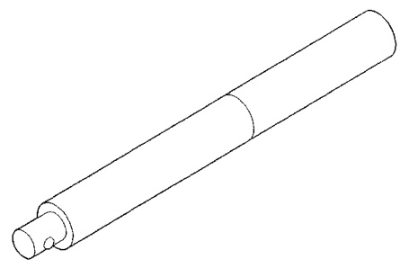
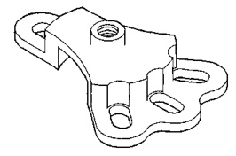
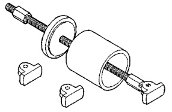
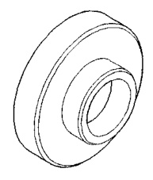
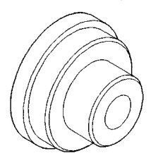
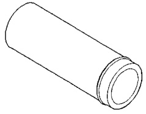
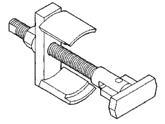

# DIFFERENTIAL AND DRIVELINE 3-85

## SPECIAL TOOLS

### 9 1/4 AXLES

*Fig. 1 Puller, Hub—6790*

*Fig. 2 Remover, Bearing—6310*

*Fig. 3 Installer—C-4198*

*Fig. 4 Handle—C-4171*

*Fig. 5 Installer—C-4076-B*

*Fig. 6 Handle—C-4735-1*

*Fig. 7 Remover—C-4828*
