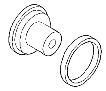
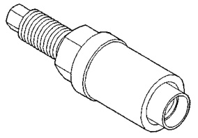
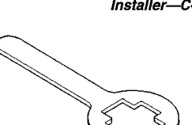
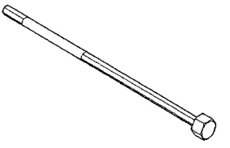
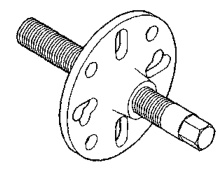
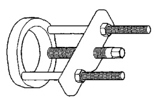
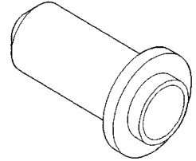
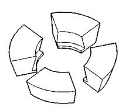

# DIFFERENTIAL AND DRIVELINE 3-86

## SPECIAL TOOLS (Continued)

*Fig. 1 Installer—C-4826*

*Fig. 2 Holder—6719*

*Fig. 3 Puller—C-452*

*Fig. 4 Installer—C-3860-A*

*Fig. 5 Installer—C-3718*

*Fig. 6 Adjustment Rod—C-4164*

*Fig. 7 Puller/Press—C-293-PA*

*Fig. 8 Adapters—C-293-47*
