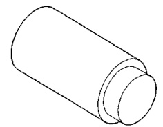
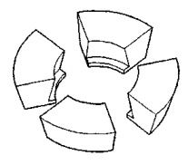
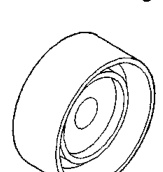
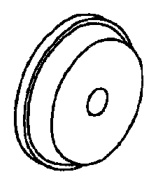
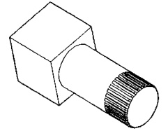
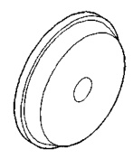
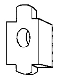
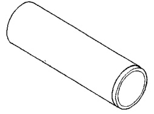

# DIFFERENTIAL AND DRIVELINE 3-87

## SPECIAL TOOLS (Continued)

*Fig. 1 Plug—C-293-3*

*Fig. 2 Installer—C-4213*

*Fig. 3 Holder—8136*

*Fig. 4 Remover—C-4309*

*Fig. 5 Adapters—C-293-37*

*Fig. 6 Installer—C-4310*

*Fig. 7 Installer—D-129*

*Fig. 8 Installer—C-3095*
