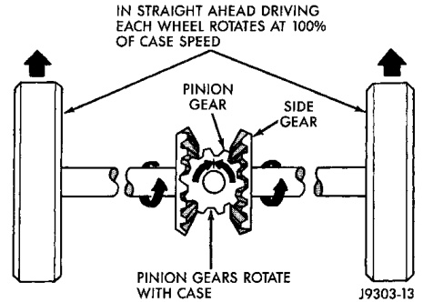
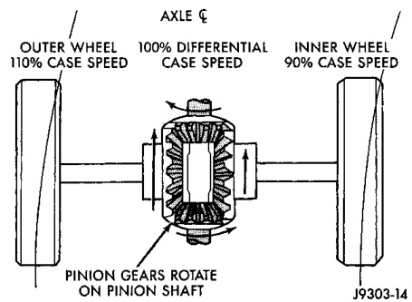

# DIFFERENTIAL AND DRIVELINE 3-90

## GENERAL INFORMATION (Continued)

Axles equipped with a Power-Lok® differential are optional for the 267 RBI axle. A Power-lok differential has a two-piece differential case. A Power-lok differential contains four pinion gears and a two-piece pinion mate cross shaft to provide increased torque to the non-slipping wheel through a ramping motion in addition to the standard Trac-lok components.

### LUBRICANT SPECIFICATIONS

A multi-purpose, hypoid gear lubricant which conforms to the following specifications should be used. Mopar® Hypoid Gear Lubricant conforms to all of these specifications.

- The lubricant should have MIL-L-2105C and API GL 5 quality specifications.
- Lubricant is a thermally stable SAE 90W gear lubricant.

Trac-lok differentials require the addition of 0.18 L (6 oz.) of friction modifier to the axle lubricant. The 248 RBI axle lubricant capacity is 2.96 L (6.25 pts.) total, including the friction modifier if necessary.

Power-lok differentials require the addition of 0.24 L (8 oz.) of friction modifier to the axle lubricant. The 267 RBI axle lubricant capacity is 3.31 L (7.0 pts.) total, including the friction modifier.

> **CAUTION:** If axle is submerged in water, lubricant must be replaced immediately to avoid possible premature axle failure.

---

## DESCRIPTION AND OPERATION

### STANDARD DIFFERENTIAL

The differential gear system divides the torque between the axle shafts. It allows the axle shafts to rotate at different speeds when turning corners.

Each differential side gear is splined to an axle shaft. The pinion gears are mounted on a pinion mate shaft and are free to rotate on the shaft. The pinion gear is fitted in a bore in the differential case and is positioned at a right angle to the axle shafts.

In operation, power flow occurs as follows:

- The pinion gear rotates the ring gear
- The ring gear (bolted to the differential case) rotates the case
- The differential pinion gears (mounted on the pinion mate shaft in the case) rotate the side gears
- The side gears (splined to the axle shafts) rotate the shafts

During straight-ahead driving, the differential pinion gears do not rotate on the pinion mate shaft. This occurs because input torque applied to the gears is divided and distributed equally between the two side gears. As a result, the pinion gears revolve with the pinion mate shaft but do not rotate around it (Fig. 1).

*Fig. 1 Differential Operation—Straight Ahead Driving*
- In Straight Ahead Driving Each Wheel Rotates at 100% of Case Speed
- Pinion Gear
- Side Gear
- Pinion Gears Rotate with Case

When turning corners, the outside wheel must travel a greater distance than the inside wheel to complete a turn. The difference must be compensated for to prevent the tires from scuffing and skidding through turns. To accomplish this, the differential allows the axle shafts to turn at unequal speeds (Fig. 2). In this instance, the input torque applied to the pinion gears is not divided equally. The pinion gears now rotate around the pinion mate shaft in opposite directions. This allows the side gear and axle shaft attached to the outside wheel to rotate at a faster speed.

*Fig. 2 Differential Operation—On Turns*
- Axle
- Outer Wheel 110% Case Speed
- 100% Differential Case Speed
- Inner Wheel 90% Case Speed
- Pinion Gears Rotate on Pinion Shaft

### TRAC-LOK/POWER-LOK OPERATION

In a conventional differential, if one wheel spins, the opposite wheel will generate only as much torque as the spinning wheel.

The 248 RBI axle is optionally equipped with a Trac-lok differential while the 267 RBI axle is optionally equipped with a Power-lok differential. Both differentials achieve the same results through slightly different means.
