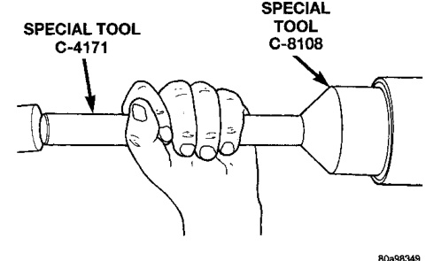
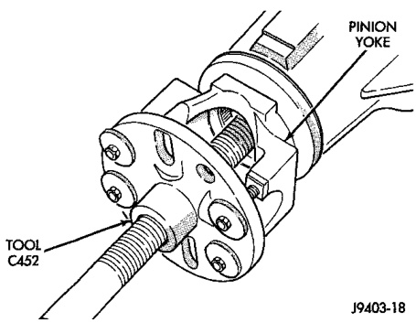

# DIFFERENTIAL AND DRIVELINE 3-97

## REMOVAL AND INSTALLATION (Continued)

(8) Install the outer axle bearing.

(9) Install the hub bearing adjustment nut. Use Socket DD-1241-JD to install the adjustment nut.

(10) Tighten the adjustment nut to 163-190 N·m (120-140 ft. lbs.) while rotating the wheel.

(11) Loosen the adjustment nut 1/8 of-a-turn to provide 0.001-inch to 0.010-inch wheel bearing end play.

(12) Tap the locking wedge into the spindle keyway and adjustment nut. Try to ensure that the locking wedge is installed into a new position in the adjustment nut.

(13) Install the axle shaft.

(14) Install the brake drum.

(15) Install the wheel and tire assembly.

---

### PINION SEAL

#### REMOVAL

(1) Raise and support the vehicle.

(2) Scribe a mark on the universal joint, pinion yoke, and pinion shaft for reference.

(3) Disconnect the propeller shaft from the pinion yoke. Secure the propeller shaft in an upright position to prevent damage to the rear universal joint.

(4) Remove the wheel and tire assemblies.

(5) Remove the brake drums to prevent any drag. The drag may cause a false bearing preload torque measurement.

(6) Rotate the pinion yoke three or four times.

(7) Measure the amount of torque necessary to rotate the pinion gear with a (in. lbs.) dial-type torque wrench. Record the torque reading for installation reference.

(8) Hold the yoke with Wrench 6719. Remove the pinion shaft nut and washer.

(9) Remove the yoke with Remover C-452 (Fig. 6).

*Fig. 6 Yoke Removal*

(10) Remove the pinion shaft seal with suitable pry tool or slide-hammer mounted screw.

#### INSTALLATION

(1) Clean the seal contact surface in the housing bore.

(2) Examine the splines on the pinion shaft for burrs or wear. Remove any burrs and clean the shaft.

(3) Inspect pinion yoke for cracks, worn splines and worn seal contact surface. Replace yoke if necessary.

> **NOTE:** The outer perimeter of the seal is pre-coated with a special sealant. An additional application of sealant is not required.

(4) Apply a light coating of gear lubricant on the lip of pinion seal.

(5) Install the new pinion shaft seal with Installer 8108 and Handle 4171 (Fig. 7).

*Fig. 7 Pinion Seal Installation*
- Special Tool 8108
- Special Tool C-4171

> **NOTE:** The seal is correctly installed when the seal flange contacts the face of the differential housing bore.

(6) Position the pinion yoke on the end of the shaft with the reference marks aligned.

(7) Seat yoke on pinion shaft with Installer C-3718 and Wrench 6719.

(8) Remove the tools and install the pinion yoke washer and nut.

> **CAUTION:** Do not exceed the minimum tightening torque when installing the pinion yoke retaining nut at this point. Damage to collapsible spacer, if equipped, or bearings may result.

(9) Hold pinion yoke with Yoke Holder 6719 and tighten shaft nut to 291.5 N·m (215 ft. lbs.) (Fig. 8). Rotate pinion shaft several revolutions to ensure the bearing rollers are seated.

(10) Rotate the pinion shaft using a (in. lbs.) torque wrench. Rotating resistance torque should be
