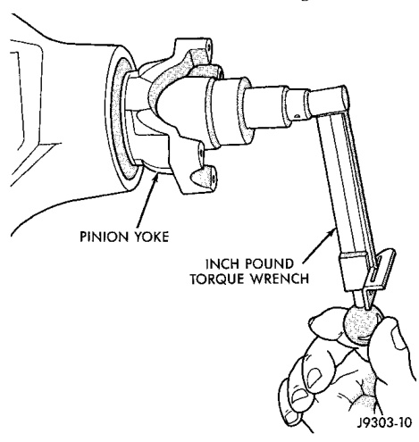
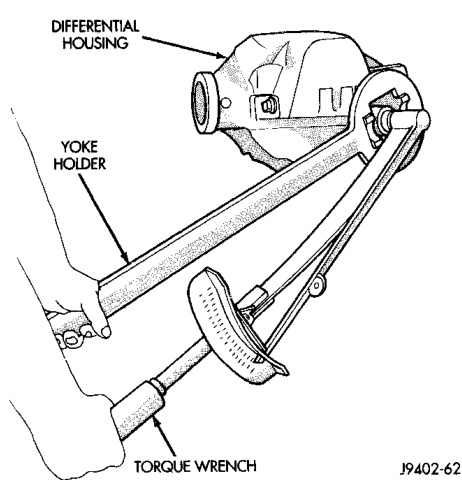
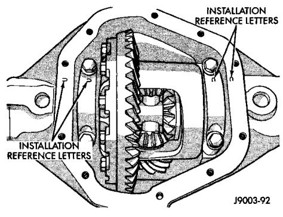

# DIFFERENTIAL AND DRIVELINE 3-98

## REMOVAL AND INSTALLATION (Continued)

*Fig. 9 Tightening Pinion Shaft Nut*
- Holder 6719
- Dial Indicator
- Special Tool C-3339
- Torque Wrench

equal to the reading recorded during removal, plus an additional 0.56 N·m (5 in. lbs.) (Fig. 9).

*Fig. 8 Check Pinion Rotation Torque*
- Pinion Nut
- Inch Pound Torque Wrench
- Pinion Yoke

> **CAUTION:** Never loosen pinion gear nut to decrease pinion gear bearing rotating torque and never exceed specified preload torque. If preload torque is exceeded a new pinion nut and collapsible spacer, if equipped, must be installed. The torque sequence will then have to be repeated.

(11) If the rotating torque is low, use Yoke Holder 6719 to hold the pinion yoke (Fig. 8) and tighten the pinion shaft nut in 6.8 N·m (5 ft. lbs.) increments until proper rotating torque is achieved.

> **NOTE:** The bearing rotating torque should be constant during a complete revolution of the pinion. If the rotating torque varies, this indicates a binding condition.

(12) Install the propeller shaft with the installation reference marks aligned.

(13) Tighten the universal joint yoke clamp screws to 19 N·m (14 ft. lbs.).

(14) Install the brake drums.

(15) Add gear lubricant to the differential housing, if necessary. Refer to the Lubricant Specifications for gear lubricant requirements.

(16) Install wheel and tire assemblies and lower the vehicle.

---

### DIFFERENTIAL

#### REMOVAL

(1) Remove axle shafts.

(2) Note the orientation of the installation reference letters stamped on the bearing caps and housing machined sealing surface (Fig. 10).

*Fig. 10 Bearing Cap Identification*
- Installation Reference Letters
- Housing
- Differential Bearing Caps

(3) Remove the differential bearing caps.

(4) Position Spreader W-129-B with the tool dowel pins seated in the locating holes (Fig. 11).

(5) Install the hold down clamps and tighten the tool turnbuckle finger-tight.

(6) Install a Guide Pin C-3288-B at the left side of the differential housing. Attach dial indicator to housing pilot stud. Load the indicator plunger against the opposite side of the housing (Fig. 11) and zero the indicator.
