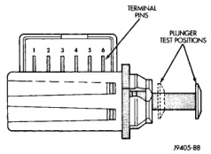

# BRAKES 5-10

## DIAGNOSIS AND TESTING (Continued)

### THUMP/CLUNK NOISE

Thumping or clunk noises during braking are frequently not caused by brake components. In many cases, such noises are caused by loose or damaged steering, suspension, or engine components. However, calipers that bind on the slide surfaces can generate a thump or clunk noise. In addition, worn out, improperly adjusted, or improperly assembled rear brake shoes can also produce a thump noise.

### STOP LAMP SWITCH

Stop lamp switch operation can be tested with an ohmmeter. The ohmmeter is used to check continuity between the pin terminals at different plunger positions (Fig. 6).

> **NOTE:** The switch wire harness must be disconnected before testing switch continuity.

### SWITCH CIRCUIT IDENTIFICATION

- Terminals 1 and 2 are for the RWAL/ABS module and Powertrain Control Module (PCM) circuit
- Terminals 5 and 6 are for the stop lamp circuit
- Terminals 3 and 4 are for the speed control circuit

*Fig. 6 Stop Lamp Switch Terminal Identification*
- Terminal Pins
- Plunger Test Positions

### SWITCH CONTINUITY TEST

1. Check continuity between terminal pins 5 and 6 as follows:

   (a) Pull plunger all the way out to fully extended position.

   (b) Attach test leads to pins 5 and 6 and note ohmmeter reading.

   (c) If continuity exists, proceed to next test. Replace switch if meter indicates lack of continuity (shorted or open).

2. Check continuity between terminal pins 1 and 2 and pins 3 and 4 as follows:

   (a) Push switch plunger inward to fully retracted position.

   (b) Attach test leads to pins 1 and 2 and note ohmmeter reading.

   (c) If continuity exists, switch is OK. Replace switch if meter indicates lack of continuity (switch is open).

### RED BRAKE WARNING LAMP

The red warning lamp is in circuit with the parking brake switch and pressure differential switch in the combination valve.

The red lamp illuminates when the parking brakes are applied, or when a pressure drop occurs in the front or rear brake hydraulic circuit.

The lamp illuminates for approximately 2-4 seconds at every engine start up. This is a self test feature designed to check bulb and circuit operation.

A pressure drop in the front or rear brake hydraulic circuit activates the pressure differential valve inside the combination valve. A pressure decrease moves the valve toward the low pressure side. As the valve moves, it pushes the pressure differential switch contact plunger upward. This closes the switch internal contacts and completes the circuit to the red warning lamp. The lamp will remain on until repairs are made and normal fluid pressure restored.

### MASTER CYLINDER/POWER BOOSTER

1. Start engine and check booster vacuum hose connections. A hissing noise indicates vacuum leak. Correct any vacuum leak before proceeding.

2. Stop engine and shift transmission into Neutral.

3. Pump brake pedal until all vacuum reserve in booster is depleted.

4. Press and hold brake pedal under light foot pressure. The pedal should hold firm, if the pedal falls away master cylinder is faulty (internal leakage).

5. Start engine and note pedal action it should fall away slightly under light foot pressure then hold firm. If no pedal action is discernible, power booster, vacuum supply, or vacuum check valve is faulty. Proceed to the POWER BOOSTER VACUUM TEST.

6. If the POWER BOOSTER VACUUM TEST passes, rebuild booster vacuum reserve as follows: Release brake pedal. Increase engine speed to 1500 rpm, close the throttle and immediately stop turn off ignition to stop engine.

7. Wait a minimum of 90 seconds and try brake action again. Booster should provide two or more vacuum assisted pedal applications. If vacuum assist is not provided, booster is faulty.
