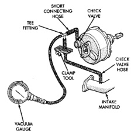
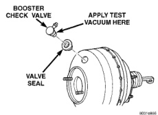

# BRAKES 5-11

## DIAGNOSIS AND TESTING (Continued)

### POWER BOOSTER VACUUM TEST

1. Connect vacuum gauge to booster check valve with short length of hose and T-fitting (Fig. 7).

2. Start and run engine at curb idle speed for one minute.

3. Observe the vacuum supply. If vacuum supply is not adequate, repair vacuum supply.

4. Clamp hose shut between vacuum source and check valve.

5. Stop engine and observe vacuum gauge.

6. If vacuum drops more than one inch HG (33 millibars) within 15 seconds, booster diaphragm or check valve is faulty.

*Fig. 7 Typical Booster Vacuum Test Connections*
- Short Connecting Hose
- Check Valve
- Tee Fitting
- Clamp Tool
- Check Valve Hose
- Intake Manifold
- Vacuum Gauge

### POWER BOOSTER CHECK VALVE TEST

1. Disconnect vacuum hose from check valve.

2. Remove check valve and valve seal from booster.

3. Use a hand operated vacuum pump for test.

4. Apply 15-20 inches vacuum at large end of check valve (Fig. 8).

5. Vacuum should hold steady. If gauge on pump indicates vacuum loss, check valve is faulty and should be replaced.

*Fig. 8 Vacuum Check Valve And Seal*
- Booster Check Valve
- Apply Test Vacuum Here
- Valve Seal

### HYDRAULIC BOOSTER

The hydraulic booster uses hydraulic pressure from the power steering pump. Before diagnosing a booster problem, first verify the power steering pump is operating properly. Perform the following checks.

- Check the power steering fluid level.
- Check the brake fluid level.
- Check all power steering hoses and lines for leaks and restrictions.
- Check power steering pump pressure.

### NOISES

The hydraulic booster unit will produce certain characteristic booster noises. The noises may occur when the brake pedal is used in a manner not associated with normal braking or driving habits.

### HISSING

A hissing noise may be noticed when above normal brake pedal pressure is applied, 40 lbs. or above. The noise will be more noticeable if the vehicle is not moving. The noise will increase with the brake pedal pressure and an increase of system operating temperature.

### CLUNK-CHATTER-CLICKING

A clunk-chatter-clicking may be noticed when the brake pedal is released quickly, after above normal brake pedal pressure is applied 50-100 lbs.

### BOOSTER FUNCTION TEST

With the engine off depress the brake pedal several times to discharge the accumulator. Then depress the brake pedal using 40 lbs. of force and start the engine. The brake pedal should fall and then push back against your foot. This indicates the booster is operating properly.

### ACCUMULATOR LEAKDOWN

1. Start the engine, apply the brakes and turn the steering wheel from lock to lock. This will ensure the accumulator is charged. Turn off the engine and let the vehicle sit for one hour. After one hour there should be at least two power assisted brake applications with the engine off. If the system does not retain a charge the booster must be replaced.

2. With the engine off depress the brake pedal several times to discharge the accumulator. Grasp the accumulator and see if it wobbles or turns. If it
