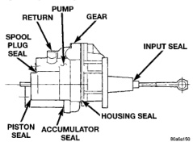

# BRAKES 5-12

## DIAGNOSIS AND TESTING (Continued)

does the accumulator has lost a gas charge and the booster must be replaced.

### SEAL LEAKAGE

If the booster leaks from any of the seals the booster assembly must be replaced (Fig. 9).

- **INPUT ROD SEAL:** Fluid leakage from rear end of the booster.
- **PISTON SEAL:** Fluid leakage from vent at front of booster.
- **HOUSING SEAL:** Fluid leakage between housing and housing cover.
- **SPOOL VALVE SEAL:** Fluid leakage near spool plug.
- **RETURN PORT FITTING SEAL:** Fluid leakage from port fitting.

*Fig. 9 Hydraulic Booster Seals*
- Pump Return
- Gear
- Spool Plug Seal
- Input Seal
- Piston Seal
- Accumulator Seal
- Housing Seal

### HEIGHT SENSING PROPORTIONING VALVE

The valve has a fixed split point when the vehicle is unloaded. The pressure is equal into and out of the valve up to the 150 psi, split point. After that the output pressure decreases on a .43 slope (Fig. 10). When the vehicle is loaded the actuator lever is moved upward, allowing full hydraulic pressure to the rear brakes. Hydraulic pressure into the valve is equal to the pressure coming out of the valve at all times.

### COMBINATION VALVE

**Pressure Differential Switch**

1. Have helper sit in drivers seat to apply brake pedal and observe red brake warning light.

2. Raise vehicle on hoist.

3. Connect bleed hose to a rear wheel cylinder and immerse hose end in container partially filled with brake fluid.

4. Have helper press and hold brake pedal to floor and observe warning light.

   (a) If warning light illuminates, switch is operating correctly.

   (b) If light fails to illuminate, check circuit fuse, bulb, and wiring. The parking brake switch can be used to aid in identifying whether or not the brake light bulb and fuse is functional. Repair or replace parts as necessary and test differential pressure switch operation again.

5. If warning light still does not illuminate, switch is faulty. Replace combination valve assembly, bleed brake system and verify proper switch and valve operation.

---

## HYDRAULIC BOOSTER DIAGNOSIS CHART

| CONDITION | POSSIBLE CAUSES | CORRECTION |
|-----------|-----------------|------------|
| Slow Brake Pedal Return | 1. Excessive seal friction in booster. | 1. Replace booster. |
| | 2. Faulty spool valve action. | 2. Replace booster. |
| | 3. Restriction in booster return hose. | 3. Replace hose. |
| | 4. Damaged input rod. | 4. Replace booster. |
| Excessive Brake Pedal Effort | 1. Internal or external seal leakage. | 1. Replace booster. |
| | 2. Faulty steering pump. | 2. Replace pump. |
| Brakes Self Apply | 1. Dump valve faulty. | 1. Replace booster. |
| | 2. Contamination in hydraulic system. | 2. Flush hydraulic system and replace booster. |
| | 3. Restriction in booster return hose. | 3. Replace hose. |
| Booster Chatter, Pedal Vibration | 1. Slipping pump belt. | 1. Replace power steering belt. |
| | 2. Low pump fluid level. | 2. Fill pump and check for leaks. |
| Grabbing Brakes | 1. Low pump flow. | 1. Test and repair/replace pump. |
| | 2. Faulty spool valve action. | 2. Replace booster. |
