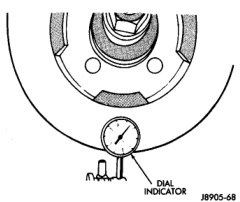
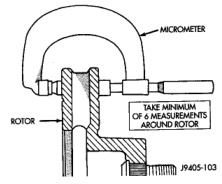

# BRAKES 5-13

## DIAGNOSIS AND TESTING (Continued)

*Fig. 10 Pressure Chart*
- Proportional Valve Ratio: 2.3:1 Split: 150
- Input/Output pressure table showing split point behavior

### DISC BRAKE ROTOR

The rotor braking surfaces should not be refinished unless necessary.

Light surface rust and scale can be removed with a lathe equipped with dual sanding discs. The rotor surfaces can be restored by machining in a disc brake lathe if surface scoring and wear are light.

Replace the rotor under the following conditions:

- severely scored
- tapered
- hard spots
- cracked
- below minimum thickness

### ROTOR MINIMUM THICKNESS

Measure rotor thickness at the center of the brake shoe contact surface. Replace the rotor if worn below minimum thickness, or if machining would reduce thickness below the allowable minimum.

Rotor minimum thickness is usually specified on the rotor hub. The specification is either stamped or cast into the hub surface.

### ROTOR RUNOUT

Check rotor lateral runout with dial indicator C-3339 (Fig. 11). Excessive lateral runout will cause brake pedal pulsation and rapid, uneven wear of the brake shoes. Position the dial indicator plunger approximately 25.4 mm (1 in.) inward from the rotor edge.

> **NOTE:** Be sure wheel bearing has zero end play before checking rotor runout.

Maximum allowable rotor runout is 0.127 mm (0.005 in.).

*Fig. 11 Checking Rotor Runout And Thickness Variation*
- Dial Indicator
- Rotor

### ROTOR THICKNESS VARIATION

Variations in rotor thickness will cause pedal pulsation, noise and shudder.

Measure rotor thickness at 6 to 12 points around the rotor face (Fig. 12).

Position the micrometer approximately 25.4 mm (1 in.) from the rotor outer circumference for each measurement.

Thickness should not vary by more than 0.025 mm (0.001 in.) from point-to-point on the rotor. Machine or replace the rotor if necessary.

[Figure: Fig. 12 Measuring Rotor Thickness]
- Micrometer
- Rotor
- Take Minimum Of 6 Measurements Around Rotor

### BRAKE DRUM

The maximum allowable diameter of the drum braking surface is stamped or cast into the drum outer edge. Generally, a drum can be machined to a maximum of 1.52 mm (0.060 in.) oversize. Always
