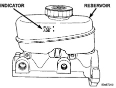

# BRAKES 5-14

## DIAGNOSIS AND TESTING (Continued)

replace the drum if machining would cause drum diameter to exceed the size limit indicated on the drum.

### BRAKE DRUM RUNOUT

Measure drum diameter and runout with an accurate gauge. The most accurate method of measurement involves mounting the drum in a brake lathe and checking variation and runout with a dial indicator.

Variations in drum diameter should not exceed 0.076 mm (0.003 in.). Drum runout should not exceed 0.20 mm (0.008 in.) out of round. Machine the drum if runout or variation exceed these values. Replace the drum if machining causes the drum to exceed the maximum allowable diameter.

### BRAKE LINE AND HOSES

Flexible rubber hose is used at both front brakes and at the rear axle junction block. Inspect the hoses whenever the brake system is serviced, at every engine oil change, or whenever the vehicle is in for service.

Inspect the hoses for surface cracking, scuffing, or worn spots. Replace any brake hose immediately if the fabric casing of the hose is exposed due to cracks or abrasions.

Also check brake hose installation. Faulty installation can result in kinked, twisted hoses, or contact with the wheels and tires or other chassis components. All of these conditions can lead to scuffing, cracking and eventual failure.

The steel brake lines should be inspected periodically for evidence of corrosion, twists, kinks, leaks, or other damage. Heavily corroded lines will eventually rust through causing leaks. In any case, corroded or damaged brake lines should be replaced.

Factory replacement brake lines and hoses are recommended to ensure quality, correct length and superior fatigue life. Care should be taken to make sure that brake line and hose mating surfaces are clean and free from nicks and burrs. Also remember that right and left brake hoses are not interchangeable.

Use new copper seal washers at all caliper connections. Be sure brake line connections are properly made (not cross threaded) and tightened to recommended torque.

### BRAKE FLUID CONTAMINATION

Indications of fluid contamination are swollen or deteriorated rubber parts.

Swollen rubber parts indicate the presence of petroleum in the brake fluid.

To test for contamination, put a small amount of drained brake fluid in clear glass jar. If fluid separates into layers, there is mineral oil or other fluid contamination of the brake fluid.

If brake fluid is contaminated, drain and thoroughly flush system. Replace master cylinder, proportioning valve, caliper seals, wheel cylinder seals, Antilock Brakes hydraulic unit and all hydraulic fluid hoses.

---

## SERVICE PROCEDURES

### BRAKE FLUID LEVEL

Always clean the master cylinder reservoir and caps before checking fluid level. If not cleaned, dirt could enter the fluid.

The fluid fill level is indicated on the side of the master cylinder reservoir (Fig. 13).

The correct fluid level is to the FULL indicator on the side of the reservoir. If necessary, add fluid to the proper level.

*Fig. 13 Master Cylinder Fluid Level - Typical*
- Indicator
- Reservoir
- Full Add

### FLUSHING HYDRAULIC BOOSTER

Flushing is required when the power steering/hydraulic booster system has become contaminated. Contaminated fluid in the booster system can cause seal deterioration and affect booster spool valve operation. Refer to Group 19 for flushing service procedure.

### MASTER CYLINDER BLEEDING

A new master cylinder should be bled before installation on the vehicle. Required bleeding tools include bleed tubes and a wood dowel to stroke the pistons. Bleed tubes can be fabricated from brake line.

### BLEEDING PROCEDURE

1. Mount master cylinder in vise.

2. Attach bleed tubes to cylinder outlet ports. Then position each tube end into reservoir (Fig. 14).

3. Fill reservoir with fresh brake fluid.

4. Press cylinder pistons inward with wood dowel. Then release pistons and allow them to return under
