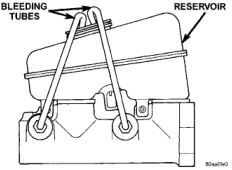
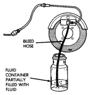

# BRAKES 5-15

## SERVICE PROCEDURES (Continued)

spring pressure. Continue bleeding operations until air bubbles are no longer visible in fluid.

*Fig. 14 Master Cylinder Bleeding-Typical*
- Bleeding Tubes
- Reservoir

### HYDRAULIC BOOSTER BLEEDING

The hydraulic booster is generally self-bleeding, this procedure will normally bleed the air from the booster. Normal driving and operation of the unit will remove any remaining trapped air.

1. Fill power steering pump reservoir.
2. Disconnect fuel shutdown relay and crank the engine for several seconds. Refer to Group 14 Fuel System for relay location and WARNING.
3. Check fluid level and add if necessary.
4. Connect fuel shutdown relay and start the engine.
5. Turn the steering wheel slowly from lock to lock twice.
6. Stop the engine and discharge the accumulator by depressing the brake pedal 5 times.
7. Start the engine and turn the steering wheel slowly from lock to lock twice.
8. Turn off the engine and check fluid level and add if necessary.

> **NOTE:** If fluid foaming occurs, wait for foam to dissipate and repeat steps 7 and 8.

### BRAKE BLEEDING

Use Mopar brake fluid, or an equivalent quality fluid meeting SAE J1703-F and DOT 3 standards only. Use fresh, clean fluid from a sealed container at all times.

Do not pump the brake pedal at any time while bleeding. Air in the system will be compressed into small bubbles that are distributed throughout the hydraulic system. This will make additional bleeding operations necessary.

Do not allow the master cylinder to run out of fluid during bleed operations. An empty cylinder will allow additional air to be drawn into the system. Check the cylinder fluid level frequently and add fluid as needed.

Bleed only one brake component at a time in the following sequence:

- master cylinder
- combination valve
- right rear wheel
- left rear wheel
- right front wheel
- left front wheel

### MANUAL BLEEDING

1. Remove reservoir filler caps and fill reservoir with Mopar, or equivalent quality DOT 3 brake fluid.
2. If calipers, or wheel cylinders were overhauled, open all caliper and wheel cylinder bleed screws. Then close each bleed screw as fluid starts to drip from it. Top off master cylinder reservoir once more before proceeding.
3. Attach one end of bleed hose to bleed screw and insert opposite end in glass container partially filled with brake fluid (Fig. 15). Be sure end of bleed hose is immersed in fluid.

*Fig. 15 Bleed Hose Setup*
- Bleed Hose
- Fluid Container Partially Filled with Fluid

4. Open up bleeder, then have a helper press down the brake pedal. Once the pedal is down close the bleeder. Repeat bleeding until fluid stream is clear and free of bubbles. Then move to the next wheel.
