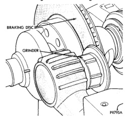
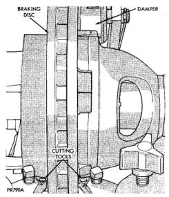

# BRAKES 5-16

## SERVICE PROCEDURES (Continued)

### PRESSURE BLEEDING

Follow the manufacturers instructions carefully when using pressure equipment. Do not exceed the tank manufacturers pressure recommendations. Generally, a tank pressure of 15-20 psi is sufficient for bleeding.

Fill the bleeder tank with recommended fluid and purge air from the tank lines before bleeding.

Do not pressure bleed without a proper master cylinder adapter. The wrong adapter can lead to leakage, or drawing air back into the system. Use adapter provided with the equipment or Adapter 6921.

### DISC ROTOR MACHINING

Rotor braking surfaces can be sanded or machined in a disc brake lathe.

The lathe must machine both sides of the rotor simultaneously with dual (two) cutter heads (Fig. 16). Equipment capable of machining only one side at a time will produce a tapered rotor.

The lathe should also be equipped with a grinder attachment or dual sanding discs for final cleanup or light refinishing (Fig. 17).

If the rotor surfaces only need minor cleanup of rust, scale, or minor scoring, use abrasive discs to clean up the rotor surfaces. However, when a rotor is scored or worn, machining with cutting tools will be required.

> **CAUTION:** Do not machine the rotor if it will cause the rotor to fall below minimum allowable thickness.

*Fig. 17 Rotor Refinishing*
- Braking Disc
- Damper
- Cutting Tools

*Fig. 16 Rotor Grinder*
- Braking Disc
- Grinder

### BRAKE DRUM MACHINING

The brake drums can be machined on a drum lathe when necessary. Initial machining cuts should be limited to 0.12 - 0.20 mm (0.005 - 0.008 in.) at a time as heavier feed rates can produce taper and surface variation. Final finish cuts of 0.025 to 0.038 mm (0.001 to 0.0015 in.) are recommended and will generally provide the best surface finish.

Be sure the drum is securely mounted in the lathe before machining operations. A damper strap should always be used around the drum to reduce vibration and avoid chatter marks.

The maximum allowable diameter of the drum braking surface is stamped or cast into the drum outer edge. Always replace the drum if machining would cause drum diameter to exceed the size limit indicated on the drum.

### BRAKE LINE

Mopar preformed metal brake line is recommended and preferred for all repairs. However, double-wall steel line can be used for emergency repair when factory replacement parts are not readily available.

Special, heavy duty tube bending and flaring equipment is required to prepare double wall brake line. Special bending tools are needed to avoid kinking or twisting metal brake line. In addition, special flaring tools are needed to provide the inverted-type, double flare required on metal brake lines.
