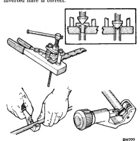
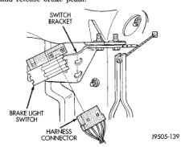
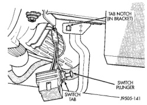

# BRAKES 5-17

## SERVICE PROCEDURES (Continued)

### FLARING PROCEDURE

1. Cut off damaged tube with Tubing Cutter.

2. Ream cut edges of tubing to ensure proper flare.

3. Install replacement tube nut on section of tube to be repaired.

4. Insert tube in flaring tool. Center tube in area between vertical posts.

5. Place gauge form over the end of the tube.

6. Push tubing through flaring tool jaws until tube contacts recessed notch in gauge that matches tube diameter.

7. Squeeze flaring tool jaws to lock tubing in place.

8. Insert plug on gauge in the tube. Then swing compression disc over gauge and center tapered flaring screw in recess of compression disc (Fig. 18).

9. Tighten tool handle until plug gauge is seated on jaws of flaring tool. This will start the inverted flare.

10. Remove the plug gauge and complete the inverted flare.

11. Remove the flaring tools and verify that the inverted flare is correct.

*Fig. 18 Inverted Flare Tools*

---

## REMOVAL AND INSTALLATION

### STOP LAMP SWITCH

**REMOVAL**

1. Remove knee bolster for access to stop lamp switch and pedal.

2. Disconnect switch harness (Fig. 19).

3. Press and hold brake pedal in applied position.

4. Rotate switch counterclockwise about 30° to align switch lock tab with notch in bracket.

5. Pull switch rearward out of mounting bracket and release brake pedal.

*Fig. 19 Stop Lamp Switch & Harness Connector*
- Switch Bracket
- Brake Light Switch
- Harness Connector

**INSTALLATION**

1. Pull switch plunger all the way out to fully extended position.

2. Push switch plunger inward 4 detent positions (or clicks). This is required preset position for switch installation. Plunger will extend approximately 14 mm (0.55 in.) out of housing at this setting.

3. Connect harness wires to switch.

4. Press and hold brake pedal down.

5. Install switch. Align tab on switch with notch in switch bracket (Fig. 20). Then insert switch in bracket and turn it clockwise about 30° to lock it in place.

*Fig. 20 Stop Lamp Switch*
- Tab Notch (In Bracket)
- Switch Plunger
- Switch Tab

6. Release brake pedal. Then lightly pull pedal fully rearward. Pedal will adjust switch plunger to correct position as pedal is moved to rear.
