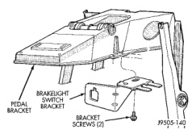
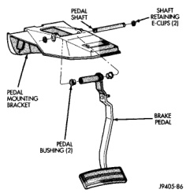

# BRAKES 5-18

## REMOVAL AND INSTALLATION (Continued)

> **CAUTION:** Do not use excessive force to move the pedal rearward for switch adjustment. Excessive force will damage the switch.

### BRAKE PEDAL

**REMOVAL**

1. Remove knee bolster.

2. Remove stop lamp switch.

3. Remove switches from tabs on stop lamp switch bracket.

4. Remove stop lamp switch bracket bolts and remove bracket (Fig. 21).

*Fig. 21 Brake Lamp Switch Bracket*
- Pedal Bracket
- Brakelight Switch Bracket
- Bracket Screws (2)

5. Remove clip and washer attaching booster push rod and slide push rod off pedal.

6. Remove E-clip from passenger side of pedal shaft (Fig. 22). Use flat blade screwdriver to pry clip out of shaft groove.

7. Push shaft toward driver side of bracket just enough to expose opposite E-clip. Then remove E-clip with flat blade screwdriver.

8. Push pedal shaft back and out of passenger side of bracket (Fig. 22).

9. Remove pedal shaft, brake pedal, wave washer and bushings from vehicle.

*Fig. 22 Brake Pedal Mounting (With Automatic Transmission)*
- Pedal Shaft
- Shaft Retaining E-Clips (2)
- Pedal Mounting Bracket
- Brake Pedal
- Pedal Bushing (2)

**INSTALLATION**

1. Replace bracket and pedal bushings if necessary. Lubricate shaft bores in bracket and pedal before installing bushings with Mopar Multi-mileage silicone grease.

2. Apply liberal quantity of Mopar multi-mileage grease to pedal shaft and to pedal and bracket bushings.

3. Position brake pedal in mounting bracket.

4. Slide pedal shaft into bracket and through pedal from passenger side.

5. Push pedal shaft out driver side of mounting bracket just enough to allow installation of retaining E-clip.

6. Install the wave washer between the bracket and the pedal bushing on the passenger side.

7. Push pedal shaft back toward passenger side of bracket and install remaining E-clip on pedal shaft.

8. Install booster push rod on brake pedal. Secure push rod to pedal with washer and retaining clip.

9. Install stop lamp switch bracket and switch.

10. Install knee bolster.

### COMBINATION VALVE

**REMOVAL**

1. Remove pressure differential switch wire connector (Fig. 23) from the valve.

2. Remove the brake lines from the valve.

3. Remove the valve mounting bolt and remove the valve from the bracket.

**INSTALLATION**

1. Position the valve on the bracket and install the mounting bolt. Tighten the mounting bolt to 23 N·m (210 in. lbs.).

2. Install the brake lines into the valve and tighten to 19-23 N·m (170-200 in. lbs.).

3. Connect the pressure differential switch wire connector.

4. Bleed the brake system.
