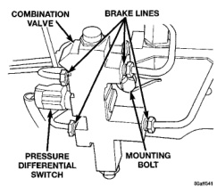
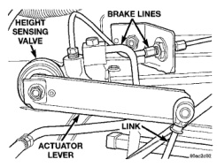
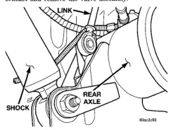
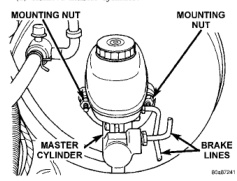

# BRAKES 5-19

## REMOVAL AND INSTALLATION (Continued)

*Fig. 23 Pressure Differential Switch*
- Combination Valve
- Brake Lines
- Pressure Differential Switch
- Mounting Bolt

### HEIGHT SENSING PROPORTIONING VALVE

**REMOVAL**

1. Raise and support vehicle.

2. Remove the link from the bracket (Fig. 24).

3. Remove the link from the actuator lever (Fig. 25).

4. Remove brake line and hose from the valve.

5. Remove the two nuts from the frame mounting bracket and remove the valve assembly.

*Fig. 25 Valve Link*
- Link
- Rear Axle
- Shock

*Fig. 24 Height Sensing Proportioning Valve*
- Height Sensing Valve
- Brake Lines
- Link
- Actuator Lever

**INSTALLATION**

1. Install the valve assembly on the frame rail and tighten the mounting nut to 34 N·m (25 ft. lbs.).

2. Install the brake line to the valve and tighten to 19 N·m (170 in. lbs.).

3. Install the brake hose to the valve and tighten the bolt to 31 N·m (276 in. lbs.)

4. Install the link to the actuator lever and bracket.

5. Bleed rear brakes.

6. Remove support and lower the vehicle.

### MASTER CYLINDER

**REMOVAL**

1. Remove brake lines from the master cylinder (Fig. 26).

2. Remove mounting nut from the master cylinder (Fig. 26).

3. Remove master cylinder.

*Fig. 26 Master Cylinder*
- Mounting Nut
- Mounting Nut
- Master Cylinder
- Brake Lines

> **NOTE:** If master cylinder is replaced, bleed the cylinder before installation.

**INSTALLATION**

1. Install master cylinder on booster mounting studs.

2. Install mounting nuts and tighten to 28 N·m (21 ft. lbs.).
