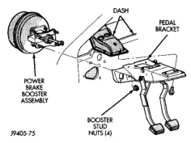
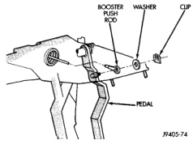
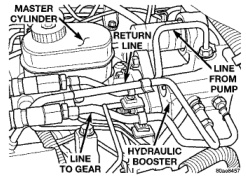

# BRAKES 5-20

## REMOVAL AND INSTALLATION (Continued)

3. Install brake lines and tighten to 19-23 N·m (170-200 in. lbs.).

4. Fill and bleed brake system.

### VACUUM BRAKE BOOSTER

**REMOVAL**

1. Remove the brake lines from the master cylinder.

2. Remove nuts attaching the master cylinder to the booster studs. Then remove master cylinder.

3. Disconnect vacuum hose at booster check valve.

4. Remove knee bolster for access to brake pedal.

5. Remove clip and washer securing booster push rod to brake pedal and slide rod off pedal (Fig. 27).

*Fig. 28 Booster Push Rod*
- Booster Push Rod
- Washer
- Clip
- Pedal

6. Remove nuts attaching booster mounting studs to dash panel and pedal mounting bracket and remove booster (Fig. 28).

*Fig. 27 Booster Mounting*
- Dash
- Pedal Bracket
- Power Brake Booster Assembly
- Booster Stud Nuts (4)

**INSTALLATION**

1. Position booster on engine compartment dash panel.

2. Install and tighten booster mounting stud nuts to 28 N·m (21 ft. lbs.).

3. Connect booster push rod to brake pedal.

4. Install knee bolster.

5. Connect vacuum hose to booster check valve.

6. Install master cylinder on the booster and tighten mounting nuts to 28 N·m (21 ft. lbs.).

7. Install the brake lines to master cylinder. Tighten brake line to 19-200 N·m (170-200 in. lbs.).

8. Fill and bleed the brake system.

### HYDRAULIC BOOSTER

> **WARNING:** THE ACCUMULATOR CONTAINS HIGH PRESSURE GAS. DO NOT CARRY THE BOOSTER BY THE ACCUMULATOR OR DROP THE UNIT ON THE ACCUMULATOR.

**REMOVAL**

> **NOTE:** If the booster is being replaced because the power steering fluid is contaminated, flush the power steering system before replacing the booster.

1. With engine off depress the brake pedal several times to discharge the accumulator.

2. Remove the brake lines from the master cylinder.

3. Remove master cylinder mounting nuts.

4. Remove the bracket from the hydraulic booster lines and master cylinder mounting studs.

5. Remove the master cylinder.

6. Remove the return hose and the two pressure lines from the hydraulic booster (Fig. 29).

7. Remove the booster push rod clip, washer and rod from the brake pedal. (Fig. 30).

8. Remove the mounting nuts from the hydraulic booster and remove the booster (Fig. 31).

*Fig. 29 Master Cylinder And Booster*
- Master Cylinder
- Return Line
- Line From Pump
- Line To Gear
- Hydraulic Booster
