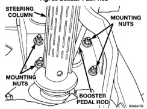
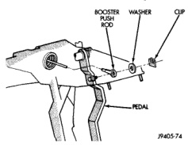
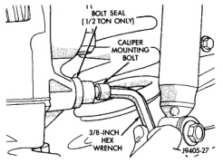
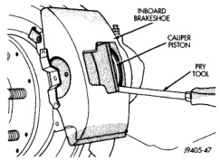

# BRAKES 5-21

## REMOVAL AND INSTALLATION (Continued)

*Fig. 31 Booster Push Rod*
- Booster Push Rod
- Washer
- Clip
- Pedal

*Fig. 30 Booster Mounting*
- Steering Column
- Mounting Nuts
- Mounting Nuts
- Booster Pedal Rod

**INSTALLATION**

1. Install the hydraulic booster and tighten the mounting nuts to 28 N·m (21 ft. lbs.).

2. Install the booster push rod, washer and clip onto the brake pedal.

3. Install the master cylinder on the mounting studs, and tighten the mounting nuts to 28 N·m (21 ft. lbs.).

4. Install the brake lines to the master cylinder and tighten to 19-200 N·m (170-200 in. lbs.).

5. Install the hydraulic booster line bracket onto the master cylinder mounting studs.

6. Install the master cylinder mounting nuts and tighten to 28 N·m (21 ft. lbs.).

7. Install the hydraulic booster pressure lines to the bracket and booster.

8. Tighten the pressure lines to 28 N·m (21 ft. lbs.).

> **NOTE:** Inspect o-rings on the pressure line fittings to insure they are in good condition before installation. Replace o-rings if necessary.

9. Install the return hose to the booster.

10. Fill and bleed the brake system.

11. Fill the power steering pump with fluid.

> **CAUTION:** Use only MOPAR power steering fluid or equivalent. Do not use automatic transmission fluid and do not overfill.

12. Bleed the hydraulic booster.

---

### DISC BRAKE CALIPER

**REMOVAL**

1. Raise vehicle.

2. Remove wheel and tire assemblies.

3. Press caliper piston back into bore with large flat blade screwdriver (Fig. 32). Use large C-clamp to bottom piston in bore if additional force is required.

*Fig. 33 Pressing Caliper Piston Into Bore*
- Inboard Brakeshoe
- Caliper Piston
- Pry Tool

4. Remove caliper mounting bolts with 3/8 hex wrench or socket (Fig. 33) and (Fig. 34).

*Fig. 32 Caliper Mounting Bolt (1/2 Ton)*
- Bolt Seal (1/2 Ton Only)
- Caliper Mounting Bolt
- 3/8-Inch Hex Wrench
