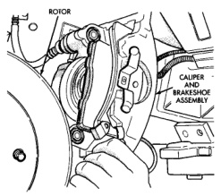
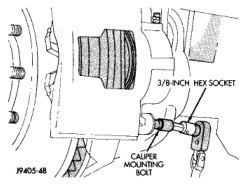
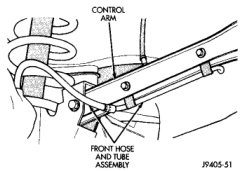
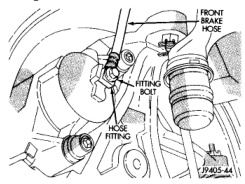

# BRAKES 5-22

## REMOVAL AND INSTALLATION (Continued)

*Fig. 35 Caliper Mounting Bolt (3/4 and 1 Ton)*
- 3/8-Inch Hex Socket
- Caliper Mounting Bolt

5. Rotate caliper rearward off rotor and out of steering knuckle support ledges (Fig. 35).

*Fig. 34 Caliper Removal/Installation*
- Rotor
- Caliper and Brakeshoe Assembly

6. Remove front brake hose fitting bolt completely and remove caliper and brake shoes as assembly.
7. Cover open end of front brake hose fitting to prevent dirt entry.

**INSTALLATION**

1. Clean caliper and steering knuckle slide surfaces with wire brush. Then apply coat of silicone grease to slide surfaces.
2. Install caliper over rotor and seat it on steering knuckle mounting arms.
3. Start caliper mounting bolts by hand to avoid cross threading. Then tighten mounting bolts to 51 N·m (38 ft. lbs.).
4. Connect brake hose to caliper (Fig. 36) and (Fig. 37). Ensure brake hose fitting is correctly seated against locating shoulder on caliper and hose is not twisted, or kinked before tightening fitting bolt.

*Fig. 37 Front Brake Hose Attachment*
- Front Brake Hose
- Hose Fitting

*Fig. 36 Front Brake Hose Routing (4WD)*
- Control Arm
- Front Hose and Tube Assembly

5. Fill and bleed brake system. Refer to procedure in appropriate antilock brake section.
6. Install wheel and tire assemblies and lower vehicle.

---

## DISC BRAKE SHOES

### REMOVAL

1. Raise and support vehicle.
2. Remove wheel and tire assemblies.
3. Press caliper piston back into bore with large flat blade screwdriver. Use large C-clamp if more force is required to bottom piston in bore.
4. Loosen bolt that secures front brake hose fitting bolt in caliper.
