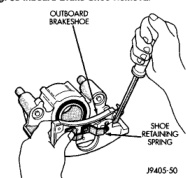
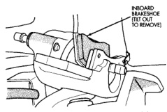
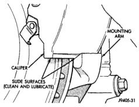
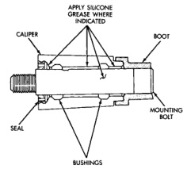

# BRAKES 5-23

## REMOVAL AND INSTALLATION (Continued)

5. Remove caliper mounting bolts with 3/8 hex wrench or socket.

6. Rotate caliper rearward off rotor and out of steering knuckle support ledges.

7. Remove inboard and outboard brake shoes (Fig. 38) and (Fig. 39). Inboard shoe has spring clip that holds it in caliper piston. Tilt this shoe out at top to unseat clip. Outboard shoe has retaining spring that secures it in caliper. Unseat one spring end and rotate shoe out of caliper.

*Fig. 39 Inboard Brake Shoe Removal*
- Inboard Brakeshoe (Tilt Out To Remove)

*Fig. 38 Outboard Brake Shoe Removal*
- Outboard Brakeshoe
- Shoe Retaining Spring

8. Secure caliper to convenient chassis or suspension component with wire.

> **CAUTION:** Do not allow the brake hose to support the caliper. Suspending the caliper by the brake hose can damage the hose and fitting joints. Use wire to support and secure the caliper to a chassis or suspension component.

If the brake shoes will be reused, do not intermix them. Keep the brake shoes with the caliper they were removed from.

> **NOTE:** Replace riveted lining if worn to within 1.5 mm (1/16 in.) of rivet heads. Replace bonded lining if thickness is 3 mm (3/16 in.) or less.

**INSTALLATION**

1. Clean caliper and steering knuckle slide surfaces with wire brush (Fig. 40). Then apply coat of Mopar multi-mileage grease to slide surfaces.

*Fig. 40 Caliper And Steering Knuckle Slide Surfaces*
- Caliper
- Slide Surfaces (Clean And Lubricate)
- Mounting Arm

2. Lubricate caliper mounting bolts, collars, bushings and bores with silicone grease as follows:

- 1/2 ton models with 75 mm caliper, apply silicone grease to mounting pins and collars. Then fill space between bushings in caliper (Fig. 41).

*Fig. 41 Mounting Bolt Lubrication (75mm Caliper)*
- Apply Silicone Grease Where Indicated
- Boot
- Caliper
- Seal
- Mounting Bolt
- Bushings
