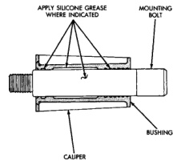
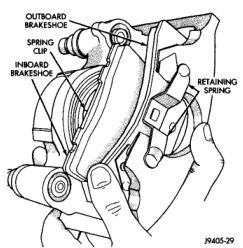
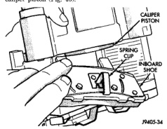
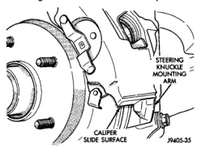

# BRAKES 5-24

## REMOVAL AND INSTALLATION (Continued)

- 3/4 and 1 ton models with 80 or 86 mm calipers, coat mounting pin and interior of bushing with silicone grease (Fig. 42).

*Fig. 42 Mounting Bolt Lubrication (80 or 86mm Caliper)*
- Apply Silicone Grease Where Indicated
- Mounting Bolt
- Bushing
- Caliper

3. Install inboard brake shoe in caliper. Be sure spring clip on shoe is properly aligned and seated in caliper piston (Fig. 43).

*Fig. 44 Inboard Brake Shoe Installation*
- Caliper Piston
- Spring Clip
- Inboard Shoe

*Fig. 43 Brake Shoe Position In Caliper*
- Outboard Brakeshoe
- Spring Clip
- Inboard Brakeshoe
- Retaining Spring

4. Install outboard brake shoe in caliper. Be sure spring ends are seated in dimples in caliper (Fig. 44).

5. Install caliper over rotor and into steering knuckle mounting arms (Fig. 45). **Be sure caliper is seated flush on mounting arm surfaces as shown.**

6. Start caliper mounting bolts by hand to avoid cross threading. Then tighten mounting bolts to 51 N·m (38 ft.lbs.) torque.

*Fig. 45 Caliper Installation*
- Steering Knuckle Mounting Arm
- Caliper
- Slide Surface

7. Install wheel and tire assemblies.

8. Pump brake pedal to reseat caliper pistons and brake shoes. **Do not move vehicle until shoes have been properly seated.**

9. Check brake fluid level and add fluid if necessary.

---

### DISC BRAKE ROTOR - WITH TAPERED BEARINGS

**REMOVAL**

1. Raise vehicle.

2. Remove wheel and tire assembly.

3. Remove caliper from rotor.

4. Remove hub extension if equipped.
