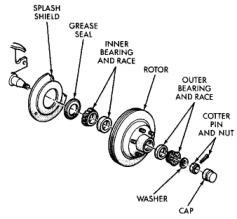
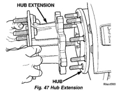

# BRAKES 5-25

## REMOVAL AND INSTALLATION (Continued)

5. Remove grease cap that covers cotter pin and hub nut.

6. Remove cotter pin from spindle and wheel bearing adjusting nut (Fig. 46).

*Fig. 46 Rotor And Hub Assembly (With Tapered Bearings)*
- Splash Shield
- Grease Seal
- Inner Bearing And Race
- Rotor
- Outer Bearing And Race
- Cotter Pin And Nut
- Washer
- Cap

7. Remove locknut from wheel bearing adjusting nut. Then remove thrust washer and outer wheel bearing.

8. Remove rotor and hub assembly from spindle.

9. Inspect wheel bearings and interior of hub. If bearings need repacking, remove grease seal and inner wheel bearing from rotor hub.

**INSTALLATION**

1. Repack wheel bearings with Mopar high temperature bearing grease. Apply grease to bearing races as well. Then install inner bearing in hub and install new grease seal.

2. Apply liberal coat of bearing grease to spindle, interior of rotor hub, grease seal lip and seal surface of spindle.

3. Install rotor and hub assembly on spindle.

4. Install outer wheel bearing thrust washer and bearing adjusting nut. Tighten nut only enough to remove end play at this time.

5. Install disc brake caliper. **Do not seat caliper pistons at this time. Pistons must not be seated until after wheel bearing adjustment has been completed.**

6. Install wheel and tire assembly. Tighten wheel nuts snug but not to final torque at this time.

7. Adjust wheel bearings by rotate wheel and fully tighten bearing adjusting nut to seat bearings.

Loosen and tighten bearing adjusting nut once again while rotating wheel.

8. Continue rotating wheel and back off adjusting nut until wheel end play is no more than 0.025 to 0.051 mm (0.001 to 0.002 in.).

9. Install nut lock on adjusting nut and install new cotter pin. Adjusting nut can be tightened slightly to align cotter pin holes if necessary. Verify that wheel bearing adjustment is still OK.

10. Install grease cap and wheel cover/hub cap.

11. Install hub extension if equipped.

12. Tighten lug nuts to proper torque.

---

### DISC BRAKE ROTOR WITH 5 STUDS AND HUB BEARINGS

**REMOVAL**

1. Raise and support vehicle.

2. Remove wheel and tire assembly.

3. Remove brake caliper.

4. Remove rotor from hub bearing.

**INSTALLATION**

1. Install rotor on hub bearing.

2. Install brake caliper.

3. Install wheel and tire assemblies.

4. Remove support and lower vehicle.

5. Apply brakes several times to seat brake shoes and caliper piston. Do not move vehicle until firm brake pedal is obtained.

---

### DISC BRAKE ROTOR WITH 8 STUDS AND HUB/BEARING

**REMOVAL**

1. Raise and support vehicle.

2. Remove wheel and tire assembly.

3. Remove hub extension mounting nuts and remove the extension from the rotor if equipped (Fig. 47).

*Fig. 47 Hub Extension*
- Hub Extension
- Hub

4. Remove brake caliper.
