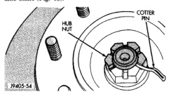
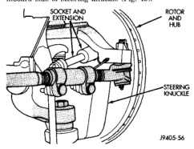
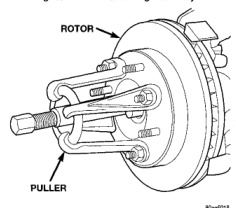
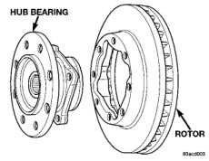
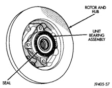

# BRAKES 5-26

## REMOVAL AND INSTALLATION (Continued)

5. Remove the cotter pin and hub nut from the axle shaft (Fig. 48).

*Fig. 48 Hub Nut Cotter Pin*
- Hub Nut
- Cotter Pin

6. Disconnect the ABS wheel speed sensor wire from under the hood. Remove sensor wire from the frame and steering knuckle.

7. Remove hub/bearing mounting bolts from inboard side of steering knuckle (Fig. 49).

*Fig. 49 Hub/Bearing Mounting Bolts*
- Socket And Extension
- Rotor And Hub
- Steering Knuckle

8. Remove rotor hub/bearing assembly (Fig. 50), brake shield and spacer from the steering knuckle.

> **NOTE:** If rotor hub assembly will not come out of the knuckle, use Puller C-844 with extra Puller Leg C-884-1 (Fig. 51) to remove the assembly.

*Fig. 51 Rotor Hub/Bearing Assembly*
- Rotor And Hub
- Unit Bearing Assembly
- Seal

*Fig. 52 Rotor Hub/Bearing Removal*
- Rotor
- Puller

*Fig. 50 Rotor And Hub/Bearing*
- Hub Bearing
- Rotor

9. Press out the wheel studs/hub extension studs and separate the rotor from the hub (Fig. 52).

**INSTALLATION**

1. Position rotor on the hub/bearing.

2. Press wheel studs/hub extension studs through the back side of the rotor and through the hub/bearing flange (Fig. 53).

3. Apply liberal quantity of anti-seize compound to splines of front drive shaft.

4. Insert two rearmost, top and bottom rotor hub bolts in steering knuckle. Insert bolts through back
