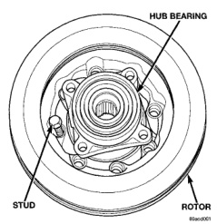
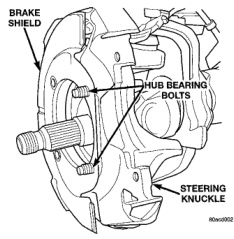
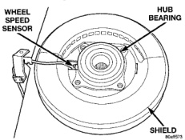
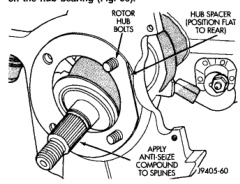

# BRAKES 5-27

## REMOVAL AND INSTALLATION (Continued)

*Fig. 53 Rotor, Hub/Bearing And Stud*
- Hub Bearing
- Stud
- Rotor

side of knuckle so they extend out front face as shown.

5. Position hub spacer (Fig. 54) and brake shield (Fig. 55) on bolts just installed in knuckle.

> **NOTE:** If the vehicle is equipped with a wheel speed sensor the brake shield must be positioned on the hub bearing (Fig. 56).

*Fig. 55 Hub Spacer*
- Rotor Hub Bolts
- Hub Spacer (Position Flat To Rear)
- Apply Anti-Seize Compound To Splines

*Fig. 56 Brake Shield*
- Brake Shield
- Hub Bearing Bolts
- Steering Knuckle

*Fig. 54 Brake Shield With Wheel Speed Sensor*
- Wheel Speed Sensor
- Hub Bearing
- Shield

6. Align rotor hub with drive shaft and start shaft into rotor hub splines.

> **NOTE:** Position wheel speed sensor wire at the top of the knuckle if equipped.

7. Align bolt holes in hub/bearing flange with bolts installed in knuckle. Then thread bolts into bearing flange far enough to hold assembly in place.

8. Install remaining bolts. Tighten hub/bearing bolts to 170 N·m (125 ft. lbs.).

9. Install washer and hub nut and tighten to 237 N·m (175 ft. lbs.).

10. Install new cotter pin in hub nut. Tighten nut as needed to align cotter pin hole in shaft with opening in nut.

11. Install brake caliper.

12. Install sensor wire to the steering knuckle and frame if equipped. Connect the wheel speed sensor wire under the hood.

13. Install wheel and tire assemblies.

14. Remove support and lower the vehicle.
