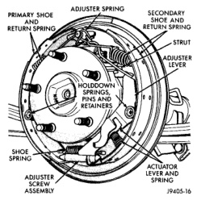
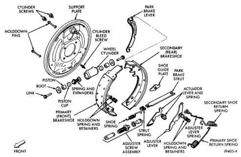

# BRAKES 5-28

## REMOVAL AND INSTALLATION (Continued)

15. Apply brakes several times to seat brake shoes and caliper piston. Do not move vehicle until firm brake pedal is obtained.

### FRONT WHEEL BEARING

On models with tapered roller front wheel bearings, the bearings and races can be serviced when necessary. The bearing races do not require special tools for removal. The race can be removed with a long tapered brass drift. Race installation is performed with a bearing race driver set.

On vehicles with unit style hub bearings the unit is bolted to the knuckle. 2500 and 3500 model vehicles with unit style hub bearing have the disc brake rotor pressed onto the unit with the wheel studs. The wheel studs must be pressed or driven out in order to separate the rotor from the hub bearing for replacement.

---

### BRAKE SHOES - 11 INCH BRAKE

**REMOVAL**

1. Raise vehicle.

2. Remove rear wheels.

3. Remove brake drums.

*Fig. 57 Brake Shoe Mounting*
- Primary Shoe And Return Spring
- Secondary Shoe And Return Spring
- Adjuster Spring
- Strut
- Adjuster Lever
- Holddown Springs, Pins And Retainers
- Shoe Spring
- Adjuster Screw Assembly
- Actuator Lever And Spring

*Fig. 58 Brake Shoes and Hardware*
- Support Plate
- Park Brake Lever
- Cylinder Screws
- Cylinder Bleed Screw
- Holddown Pins
- Wheel Cylinder
- Secondary (Rear) Brakeshoe
- Shoe Guide Plate
- Park Brake Strut
- Piston
- Boot
- Actuator Lever And Spring
- Link
- Spring And Expanders
- Secondary Shoe Return Spring
- Piston Cup
- Adjuster Lever Spring
- Primary (Front) Brakeshoe
- Holddown Spring And Retainers
- Shoe Spring
- Strut Spring
- Adjuster Screw Assembly
- Adjuster Lever
- Holddown Spring And Retainers
- Primary Shoe Return Spring

4. Remove primary (front) brake shoe return spring (Fig. 57) and (Fig. 58). Use brake spring pliers to unseat and remove spring from anchor pin.
