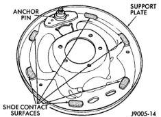

# BRAKES 5-29

## REMOVAL AND INSTALLATION (Continued)

5. Remove primary shoe hold-down spring, pin and retainers. Use brake spring tool to rotate retainers and disengage pins.

6. Tilt primary brake shoe outward. Then disengage shoe spring and remove primary brake shoe.

7. Remove adjuster screw, shoe spring and park brake strut and spring.

> **CAUTION:** The driver side adjuster screw has a right hand thread. The passenger side adjuster screw has a left hand thread. Do not interchange them as the brake shoes will not adjust properly.

8. Remove secondary brake shoe hold-down spring, pin and retainers.

9. Pull adjuster lever and retainer out of secondary brake shoe. Then rotate brake shoe out and up and remove adjuster spring and secondary shoe return spring.

10. Disconnect park brake cable from lever on secondary brake shoe. Then remove brake shoe.

11. If brake shoes are to be replaced, remove E-clip (or U-clip) that attaches park brake lever to secondary brake shoe and remove lever.

**INSTALLATION**

1. Clean support plate with brake cleaner. Then smooth shoe contact pads with wire brush or emery cloth.

2. Apply coat of high temperature bearing grease to each shoe contact pad on support plate (Fig. 59).

*Fig. 59 Typical Brake Shoe Contact Pad Locations*
- Anchor Pin
- Support Plate
- Shoe Contact Surfaces

3. Lubricate adjuster levers and anchor pin and shoe contact surfaces on support plate with high temperature bearing grease.

4. Clean and check operation of adjuster screw assemblies. Make sure each screw assembly rotates freely. Lubricate screw threads with spray lube. Replace either assembly if threads are heavily rusted, corroded, or damaged.

5. Attach park brake lever to secondary brake shoe, use new U-clip to secure lever to shoe. If U-clip is used to secure shoe, pinch clip together with channel lock pliers to secure it. If E-clip is used, be sure clip is fully seated in notch.

6. Attach park brake cable to lever.

7. Position adjuster lever on secondary brake shoe. Then install spring retainer with shoulder on in lever and into shoe.

8. Position secondary brake shoe on support plate. Use new hold-down spring, pin and retainer to secure shoe and adjuster lever.

9. Attach shoe spring to secondary brake shoe. Connect long end of spring in secondary shoe.

10. Engage parking brake strut in secondary brake shoe and install oval shaped spring on opposite end of strut (spring end of strut goes in primary shoe).

11. Install primary brake shoe on support plate. Use new hold-down spring, pin and retainers to secure shoe. Be sure parking brake strut is seated in both brake shoes.

12. Install actuator lever and spring. Hook actuator lever under adjuster lever as shown. Large diameter end of spring goes on shoe and small end on lever.

13. Install adjuster screw assembly. Be sure star wheel is positioned adjacent to adjuster lever and that notches in buttons are properly seated on brake shoes.

> **CAUTION:** Be sure the adjuster screws are installed on the correct side. The driver side adjuster screw has right hand threads and the passenger side has left hand threads. Also be sure the short end of the screw is toward the secondary brake shoe.

14. Attach shoe spring to primary brake shoe.

15. Install guide plate on anchor pin.

16. Attach adjuster spring to adjuster lever.

17. Install secondary brake shoe return spring in shoe.

18. Attach secondary shoe return spring to adjuster spring. Then install adjuster spring on anchor pin.

19. Install primary brake shoe return spring.

20. Verify that adjuster and return springs are properly installed.

21. Adjust brake shoes to drum with brake gauge.

22. Install brake drum and wheel and tire assemblies.

23. Lower vehicle.
