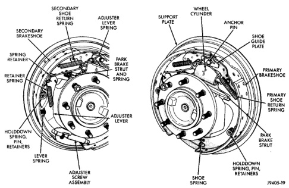

# BRAKES 5-30

## REMOVAL AND INSTALLATION (Continued)

### BRAKE SHOES - 13 INCH BRAKE

**REMOVAL**

1. Raise vehicle.

2. Remove rear wheel and tire assemblies.

3. Remove brake drums.

4. Remove primary (front) brake shoe return spring from anchor pin with brake spring pliers (Fig. 60).

5. Remove primary brake shoe hold-down spring, pin and retainers with hold-down spring tool.

6. Disconnect shoe spring and remove primary brake shoe and parking brake lever strut.

7. Remove adjuster screw assembly.

8. Remove secondary brake shoe hold-down spring, pin and retainers. Then remove adjuster lever, spring and spring retainer assembly. It is not necessary to disassemble adjuster lever components unless they are worn, or damaged.

9. Disconnect parking brake cable from lever attached to secondary brake shoe. Then remove brake shoe.

10. If brake shoes are to be replaced, remove E-clip attaching parking brake lever to secondary brake shoe and remove lever.

*Fig. 60 Brake Shoes and Hardware (13 Inch Brake)*
- Secondary Shoe Return Spring
- Adjuster Lever Spring
- Support Plate
- Wheel Cylinder
- Anchor Pin
- Shoe Guide Plate
- Secondary Brakeshoe
- Spring Retainer
- Retainer Spring
- Park Brake Strut And Spring
- Shoe Spring
- Primary Brakeshoe
- Primary Shoe Return Spring
- Holddown Spring, Pin, Retainers
- Lever Spring
- Adjuster Lever
- Adjuster Screw Assembly
- Shoe Spring
- Park Brake Strut
- Holddown Spring, Pin, Retainers

11. Inspect wheel cylinder. If leakage is evident, remove and overhaul cylinder. Refer to overhaul procedure in this section.

**INSTALLATION**

1. Clean support plate with brake cleaner. Then smooth shoe contact pads with wire brush or emery cloth.

2. Lubricate adjuster levers and anchor pin and shoe contact surfaces on support plate with high temperature bearing grease.

3. Clean and check operation of both adjuster screw assemblies. Replace either assembly if threads are heavily rusted, corroded, or damaged. Make sure each screw assembly rotates freely. Then lubricate adjuster screw threads with spray lube.

4. Attach parking brake lever to secondary brake shoe. Use new E-clip to secure lever to shoe. If lever is secured with U-clip, pinch new clip together with channel lock pliers to secure it.

5. Attach parking brake cable to parking brake lever.

6. If adjuster lever was disassembled, reassemble it as follows:

   (a) Clamp adjuster lever in vise (Fig. 61). **Clamp center portion of lever in vise only. Do not clamp bottom end of lever in vise.** Lever
