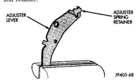
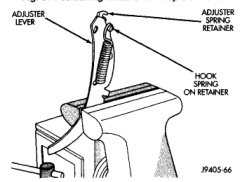

# BRAKES 5-31

## REMOVAL AND INSTALLATION (Continued)

flange that rotates adjuster screw star wheel teeth is at bottom of lever and will be damaged.

   (b) Position small, hooked spring retainer in upper end of lever (Fig. 61). Be sure tang on retainer is securely engaged in hole in lever. Locking pliers can be used to hold retainer in place after positioning.

   (c) Secure retainer in lever with retainer spring. Hook spring over end of retainer as shown (Fig. 62). Needlenose pliers and number 2 Phillips screwdriver can be used to attach spring to lever and retainer.

*Fig. 62 Positioning Retainer On Adjuster Lever*
- Adjuster Lever
- Adjuster Spring Retainer

*Fig. 61 Assembling Adjuster Lever, Spring And Retainer*
- Adjuster Lever
- Adjuster Spring Retainer
- Hook Spring On Retainer

7. Install secondary brake shoe and adjuster lever as follows:

   (a) Insert secondary shoe hold-down pin through support plate.

   (b) Position secondary brake shoe on support plate and insert pin through shoe.

   (c) Position adjuster lever on brake shoe and insert hold-down spring inner retainer into lever and shoe. Inner retainer has shoulder on it which seats in lever and shoe.

   (d) Install hold-down spring over pin and seat it in inner retainer. Then install and seat hold-down spring outer retainer on pin with hold-down spring tool.

8. Install adjuster lever spring between brake shoe and lever. Be sure spring is seated on lever tang.

9. Attach shoe spring to secondary brake shoe. Long end of spring goes in secondary shoe.

10. Install oval shaped spring on park brake strut and engage spring end of strut in secondary brake shoe.

11. Install primary brake shoe on support plate. Use new hold-down spring, pin and retainers to secure shoe. Be sure parking brake strut is seated in both brake shoes.

12. Install adjuster screw assembly. Be sure star wheel is positioned adjacent to adjuster lever and that notches in adjuster screw are properly seated on brake shoes.

> **CAUTION:** Be sure the adjuster screws were not intermixed and are installed on the correct side. The driver side adjuster screw has right hand threads and the passenger side has left hand threads. Also be sure the short end of the screw is toward the secondary brake shoe.

13. Attach shoe spring to primary brake shoe. Use brake spring pliers and long screwdriver to seat spring in shoe.

14. Install shoe guide plate on anchor pin.

15. Attach adjuster spring to spring retainer at top of adjuster lever. Then seat spring on anchor pin with brake spring pliers.

16. Install secondary brake shoe return spring. Attach short end of spring to brake shoe. Then hook opposite end on adjuster spring. Use brake spring pliers, or a long shank screwdriver to engage return spring in adjuster spring.

17. Install primary brake shoe return spring.

18. Check component installation. Be sure adjuster screw, wheel cylinder links and park brake strut are all seated in brake shoes.

19. Adjust brake shoes to drum with brake gauge.

20. Install brake drums.

21. Install wheel and tire assemblies and lower vehicle.

22. Install wheel cover or hub cap.

---

### WHEEL CYLINDER

**REMOVAL**

1. Raise vehicle and remove tire and wheel assembly.

2. Remove brake drum.

3. Lift adjuster lever away from adjuster screw. Then turn screw star wheel until screw is fully retracted.
