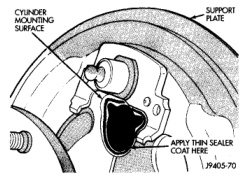
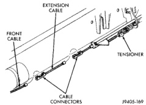

# BRAKES 5-32

## REMOVAL AND INSTALLATION (Continued)

4. Remove brake shoe return springs, adjuster spring and adjuster screw. Move upper ends of brake shoes apart to provide removal clearance for wheel cylinder links.

5. Disconnect brake line from wheel cylinder.

6. Remove wheel cylinder attaching screws and remove cylinder from support plate.

**INSTALLATION**

1. Apply thin coat of silicone sealer to wheel cylinder mounting surface of support plate (Fig. 63). Sealer prevents road splash from entering brake drum past cylinder.

*Fig. 63 Wheel Cylinder Mounting Surface*
- Cylinder Mounting Surface
- Support Plate
- Apply Thin Sealer Coat Here

2. Start brake line in cylinder inlet by hand. Do not tighten fitting at this time.

3. Mount wheel cylinder on support plate and install cylinder attaching screws. Tighten screws to 20 N·m (15 ft. lbs.).

4. Tighten brake line fitting to 13 N·m (115 in. lbs.).

5. Install brake shoe components.

6. Adjust brake shoes to drum using brake gauge.

7. Install brake drum.

8. Fill and bleed brake system.

9. Install wheel and tire assemblies and lower vehicle.

---

### BRAKE SUPPORT PLATE

**REMOVAL**

1. Remove wheel and tire assemblies.

2. Remove brake drums.

3. Remove axle shaft, refer to Group 3 for procedures.

4. Remove brake shoes and hardware for access to parking brake cable.

5. Remove parking brake cable from support plate.

6. Disconnect brake line at wheel cylinder and remove cylinder.

7. Remove bolts attaching support plate to axle and remove support plate.

**INSTALLATION**

1. Apply thin bead of silicone sealer around axle mounting surface of support plate.

2. Install support plate on axle flange. Tighten attaching bolts to 47-68 N·m (35-50 ft. lbs.).

3. Apply thin bead of silicone sealer around wheel cylinder mounting surface. Install wheel cylinder on new support plate.

4. Install parking brake cable in support plate.

5. Install brake shoes and hardware.

6. Install axle shaft, refer to Group 3 for procedure.

7. Adjust brake shoes to drum with brake gauge.

8. Install brake drums.

9. Fill and bleed brake system.

10. Install wheel and tire assemblies and lower vehicle.

---

### FRONT PARKING BRAKE CABLE

**REMOVAL**

1. Remove knee bolster.

2. Release parking brake pedal completely.

3. Raise vehicle.

4. Loosen tensioner nut to create slack in front cable and extension cable (Fig. 64).

5. Disengage front cable from extension cable connector. Extension cable also be removed at this time if necessary.

*Fig. 64 Extension-To-Front Cable Attachment*
- Extension Cable
- Front Cable
- Cable Connectors
- Tensioner

6. Lower vehicle.

7. Roll back carpet and loosen cable grommet and cable retainer (Fig. 65). Then pull cable through floorpan grommet and remove cable.
