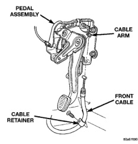
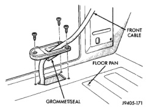
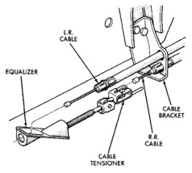

# BRAKES 5-33

## REMOVAL AND INSTALLATION (Continued)

*Fig. 66 Cable Grommet In Floorpan*
- Front Cable
- Floor Pan
- Grommet/Seal

8. Disengage front cable from arm on foot pedal assembly (Fig. 66).

*Fig. 65 Cable Attachment At Foot Pedal*
- Pedal Assembly
- Cable Arm
- Front Cable
- Cable Retainer

**INSTALLATION**

1. Insert new cable through floorpan grommet and up to arm on pedal assembly.

2. Hook cable T-connector in arm on pedal assembly.

3. Secure floorpan grommet/seal and cable retainer.

4. Realign floor carpet.

5. Install knee bolster.

6. Engage front cable and extension cable in cable connectors. Make sure right rear cable is secured in tensioner connector.

7. Adjust cable tensioner. Refer to procedure in this section.

---

### REAR PARK BRAKE CABLE

**REMOVAL**

1. Raise vehicle and remove necessary wheel and brake drum.

2. Remove secondary brake shoe and disconnect cable from parking lever attached to secondary shoe.

3. Compress rear cable retainer with hose clamp or pliers and pull cable out of support plate.

4. Remove one (or both) cables reaction bracket on left rear frame rail.

5. Disengage rear cable from tensioner (Fig. 67).

6. Compress cable retainer with hose clamp or pliers and slide cable out of bracket.

*Fig. 67 Cable And Tensioner Attachment*
- L.R. Cable
- Equalizer
- Cable Bracket
- R.R. Cable
- Cable Tensioner

**INSTALLATION**

1. Route new cable to rear brake support plate.

2. Insert cable through support plate, seat cable retainers and attach cable to parking brake lever on secondary brake shoe.

3. Install brake shoes.

4. Seat cable in body clips, reaction bracket, and frame bracket.

5. Connect cable to tensioner.

6. Adjust cable tensioner. Refer to procedure in this section.

7. Install wheel and tire assemblies.

8. Lower vehicle.

9. Verify parking brake operation.
