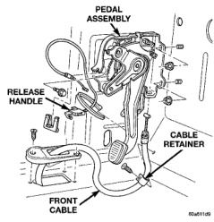
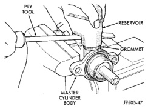
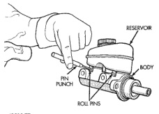

# BRAKES 5-34

## REMOVAL AND INSTALLATION (Continued)

### PARKING BRAKE PEDAL

**REMOVAL**

1. Release parking brakes.

2. Raise vehicle.

3. Loosen cable tensioner nut at equalizer to create slack in front cable.

4. Lower vehicle.

5. Remove knee bolster.

6. Disconnect brakelamp wire from switch on pedal assembly.

7. Roll carpet back, loosen front cable grommet from floorpan and cable retainer.

8. Disengage cable end connector from arm on pedal assembly.

9. Remove bolts/nuts from pedal assembly and remove assembly (Fig. 68).

*Fig. 68 Parking Brake Pedal Assembly*
- Pedal Assembly
- Release Handle
- Cable Retainer
- Front Cable

**INSTALLATION**

1. Position replacement pedal assembly on dash and cowl.

2. Install bolts/nuts and tighten to 28 N·m (21 ft. lbs.).

3. Connect front cable to arm on pedal assembly.

4. Tighten front cable grommet to floorpan and cable retainer, roll carpet back.

5. Connect wires to brakelamp switch.

6. Install knee bolster.

7. Raise vehicle.

8. Adjust parking brake cable tensioner.

---

## DISASSEMBLY AND ASSEMBLY

### MASTER CYLINDER RESERVOIR

**REMOVAL**

1. Remove reservoir cap and empty fluid into drain container.

2. Clamp cylinder body in vise with brass protective jaws.

3. Remove pins that retain reservoir to master cylinder. Use hammer and pin punch to remove pins (Fig. 69).

*Fig. 70 Reservoir Retaining Pins*
- Reservoir
- Body
- Pin Punch
- Roll Pins

4. Loosen reservoir from grommets with pry tool (Fig. 70).

*Fig. 69 Loosening Reservoir*
- Pry Tool
- Reservoir
- Grommet
- Master Cylinder Body

5. Remove reservoir by rocking it to one side and pulling free of grommets (Fig. 71).

6. Remove old grommets from cylinder body (Fig. 72).
