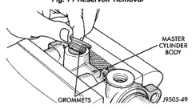
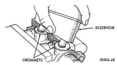
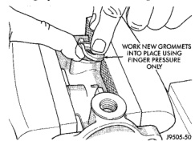
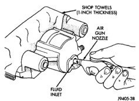

# BRAKES 5-35

## DISASSEMBLY AND ASSEMBLY (Continued)

*Fig. 72 Reservoir Removal*
- Reservoir
- Grommets

*Fig. 71 Grommet Removal*
- Master Cylinder Body
- Grommets

**INSTALLATION**

> **CAUTION:** Do not use any type of tool to install the grommets. Tools may cut, or tear the grommets creating a leak problem after installation. Install the grommets using finger pressure only.

1. Lubricate new grommets with clean brake fluid and Install new grommets in cylinder body (Fig. 73). Use finger pressure to install and seat grommets.

*Fig. 73 Grommet Installation*
- Work New Grommets Into Place Using Finger Pressure Only

2. Start reservoir in grommets. Then rock reservoir back and forth while pressing downward to seat it in grommets.

3. Install pins that retain reservoir to cylinder body.

4. Fill and bleed master cylinder on bench before installation in vehicle.

---

### DISC BRAKE CALIPER

**DISASSEMBLY**

1. Drain brake fluid from caliper.

2. Remove brake shoes from caliper.

3. Pad interior of caliper with one-inch thickness of shop towels to cushion and protect caliper piston during removal (Fig. 74).

4. Remove caliper piston with several **short** bursts of low pressure compressed air. Direct air through fluid inlet port to ease piston out of bore (Fig. 74).

> **CAUTION:** Do not blow the piston out of the bore with sustained air pressure. This could result in a cracked piston. Use only enough air pressure to ease the piston out.

> **WARNING:** NEVER ATTEMPT TO CATCH THE PISTON AS IT LEAVES THE BORE. THIS WILL RESULT IN PERSONAL INJURY.

*Fig. 74 Caliper Piston Removal*
- Shop Towels (1-Inch Thickness)
- Air Gun Nozzle
- Fluid Inlet

5. Remove piston dust boot with a suitable pry tool (Fig. 75). **Do not scratch piston bore while removing boot.** Discard dust boot as it is not reusable.

6. Remove piston seal from caliper and discard seal it is not reusable (Fig. 76) and (Fig. 77).

7. Remove mounting bolts from calipers and inspect seals, boots, and bushings (Fig. 76) and (Fig. 77). Remove these components only if cut, worn, or damaged.

8. Remove caliper bleed screw.
