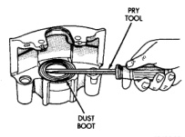
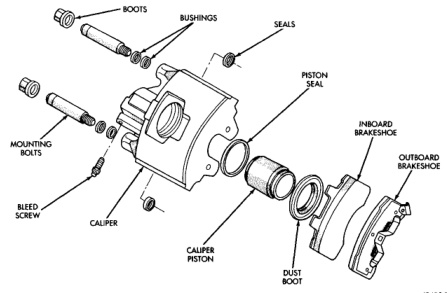

# BRAKES 5-36

## DISASSEMBLY AND ASSEMBLY (Continued)

*Fig. 75 Dust Boot Removal*
- Pry Tool
- Dust Boot

**ASSEMBLY**

> **NOTE:** Be sure caliper assembly area of workbench is clean and dry. This is important as dust, dirt, foreign material, oil, or solvents can damage seals, harm piston surfaces and contaminate fluid.

1. Clean the caliper and piston with brake cleaner, clean brake fluid, or denatured alcohol. Do not use any other cleaning agents.

2. Inspect condition of the caliper piston bore. The piston must be free of corrosion, rust, pitting, or scoring, replace the piston if it exhibits any of these conditions.

3. A fiber brush can be used to clean the bore if necessary. The bore should be free of corrosion, pitting, or scoring. Discoloration of the bore is a normal condition and not cause for replacement. The bore can be lightly polished by hand but only with crocus cloth.

> **CAUTION:** Never hone the caliper piston bore, or use any kind of abrasive material on the piston surface. Honing will result in an oversize bore and abrasives will damage the piston coating. Either of these practices will result in piston bind and eventual seizure.

4. Inspect condition of the threads in the inlet and bleed screw ports. Replace the caliper if thread damage is evident. Do not attempt to salvage the threads.

*Fig. 76 Caliper Components (75/80 mm Caliper)*
- Boots
- Bushings
- Seals
- Piston Seal
- Inboard Brakeshoe
- Outboard Brakeshoe
- Mounting Bolts
- Bleed Screw
- Caliper
- Caliper Piston
- Dust Boot
