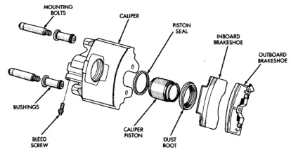
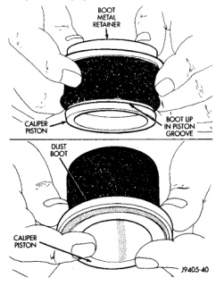

# BRAKES 5-37

## DISASSEMBLY AND ASSEMBLY (Continued)

*Fig. 78 Caliper Components (86 mm Caliper)*
- Mounting Bolts
- Caliper
- Piston Seal
- Inboard Brakeshoe
- Outboard Brakeshoe
- Bushings
- Caliper Piston
- Dust Boot
- Bleed Screw

5. Check the bushings in the caliper mounting bolt bores. Replace the bushings if worn, cut, or torn.

6. Lubricate caliper piston, piston seal and piston bore with liberal quantity of clean, fresh brake fluid.

7. Lightly lubricate lip of new boot with silicone grease. Install boot on piston and work boot lip into the groove at the top of piston (Fig. 78).

8. Stretch boot rearward to straighten boot folds, then move boot forward until folds snap into place (Fig. 78).

9. Install new piston seal into caliper bore. **Be sure square cut seal is fully seated and is not twisted.**

10. Install piston down into the caliper bore by hand or with hammer handle. Push the piston down to the bottom of the caliper bore.

11. Seat dust boot in caliper with installer (Fig. 79):
- 1/2 ton 75 mm caliper: Installer 6753
- 3/4 ton 80 mm caliper: Installer 6754
- 1 ton 86 mm caliper: Installer 6755

*Fig. 79 Installing Dust Boot*
- Boot Metal Retainer
- Caliper Piston
- Boot Lip In Piston Groove
- Dust Boot
- Caliper Piston

12. Lubricate caliper mounting bolts, collars, bushings and bores with silicone grease.

13. Install bushings, seals, boots and mounting bolts in caliper.

14. Install caliper bleed screw.

---

### WHEEL CYLINDER

**DISASSEMBLY**

1. Remove push rods and boots (Fig. 80).

2. Press pistons, cups and spring and expander out of cylinder bore.

3. Remove bleed screw.
