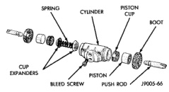
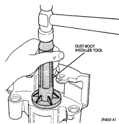
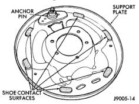

# BRAKES 5-38

## DISASSEMBLY AND ASSEMBLY (Continued)

*Fig. 80 Seating Dust Boot*
- Dust Boot Installer Tool

*Fig. 79 Wheel Cylinder Components-Typical*
- Spring
- Cylinder
- Piston Cup
- Boot
- Cup Expanders
- Piston
- Bleed Screw
- Push Rod

**ASSEMBLY**

1. Lubricate wheel cylinder bore, pistons, piston cups and spring and expander with clean brake fluid.

2. Install first piston in cylinder bore. Then install first cup in bore and against piston. **Be sure lip of piston cup is facing inward (toward spring and expander) and flat side is against piston.**

3. Install spring and expander followed by remaining piston cup and piston.

4. Install boots on each end of cylinder and insert push rods in boots.

5. Install cylinder bleed screw.

---

## CLEANING AND INSPECTION

### REAR DRUM BRAKE

**CLEANING**

Clean the individual brake components, including the support plate and wheel cylinder exterior, with a water dampened cloth or with brake cleaner. Do not use any other cleaning agents. Remove light rust and scale from the brake shoe contact pads on the support plate with fine sandpaper.

**INSPECTION**

As a general rule, riveted brake shoes should be replaced when worn to within 0.78 mm (1/32 in.) of the rivet heads. Bonded lining should be replaced when worn to a thickness of 1.6 mm (1/16 in.).

Examine the lining contact pattern to determine if the shoes are bent or the drum is tapered. The lining should exhibit contact across its entire width. Shoes exhibiting contact only on one side should be replaced and the drum checked for runout or taper.

Inspect the adjuster screw assembly. Replace the assembly if the star wheel or threads are damaged, or the components are severely rusted or corroded.

Discard the brake springs and retainer components if worn, distorted or collapsed. Also replace the springs if a brake drag condition had occurred. Overheating will distort and weaken the springs.

Inspect the brake shoe contact pads on the support plate, replace the support plate if any of the pads are worn or rusted through. Also replace the plate if it is bent or distorted (Fig. 81).

*Fig. 81 Shoe Contact Surfaces*
- Anchor Pin
- Support Plate
- Shoe Contact Surfaces

### CALIPER

**CLEANING**

Clean the caliper components with clean brake fluid or brake clean only. Wipe the caliper and piston
