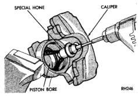

# BRAKES 5-39

## CLEANING AND INSPECTION (Continued)

dry with lint free towels or use low pressure compressed air.

> **CAUTION:** Do not use gasoline, kerosene, thinner, or similar solvents. These products may leave a residue that could damage the piston and seal.

**INSPECTION**

The piston is made from a phenolic resin (plastic material) and should be smooth and clean.

The piston must be replaced if cracked or scored. Do not attempt to restore a scored piston surface by sanding or polishing.

> **CAUTION:** If the caliper piston is replaced, install the same type of piston in the caliper. Never interchange phenolic resin and steel caliper pistons. The pistons, seals, seal grooves, caliper bore and piston tolerances are different.

The bore can be lightly polished with a brake hone to remove very minor surface imperfections (Fig. 82). The caliper should be replaced if the bore is severely corroded, rusted, scored, or if polishing would increase bore diameter more than 0.025 mm (0.001 inch).

*Fig. 82 Polishing Piston Bore*
- Special Hone
- Caliper
- Piston Bore

### WHEEL CYLINDER

**CLEANING**

Clean the cylinder and pistons with clean brake fluid or brake cleaner only. Do not use any other cleaning agents.

Dry the cylinder and pistons with compressed air. Do not use rags or shop towels to dry the cylinder components. Lint from cloth material will adhere to the cylinder bores and pistons.

**INSPECTION**

Inspect the cylinder bore. Light discoloration and dark stains in the bore are normal and will not impair cylinder operation.

The cylinder bore can be lightly polished but only with crocus cloth. Replace the cylinder if the bore is scored, pitted or heavily corroded. Honing the bore to restore the surface is not recommended.

Inspect the cylinder pistons. The piston surfaces should be smooth and free of scratches, scoring and corrosion. Replace the pistons if worn, scored, or corroded. Do not attempt to restore the surface by sanding or polishing.

Discard the old piston cups and the spring and expander. These parts are not reusable. The original dust boots may be reused but only if they are in good condition.

---

## ADJUSTMENTS

### STOP LAMP SWITCH

1. Push and hold brake pedal down.

2. Pull switch plunger all the way out to fully extended position.

3. Push switch plunger inward 4 detent positions (or clicks). This is required preset position. Plunger will extend approximately 14 mm (0.55 in.) out of housing at this setting.

4. Release brake pedal. Then lightly pull pedal fully rearward. Pedal will adjust switch plunger to correct position as pedal is moved to rear.

> **CAUTION:** Do not use excessive force to move the pedal rearward for switch adjustment. Excessive force will damage the switch.

### REAR DRUM BRAKE

The rear drum brakes are equipped with a self-adjusting mechanism. Under normal circumstances, the only time adjustment is required is when the shoes are replaced, removed for access to other parts, or when one or both drums are replaced.

Adjustment can be made with a standard brake gauge or with adjusting tool. Adjustment is performed with the complete brake assembly installed on the backing plate.

**ADJUSTMENT WITH BRAKE GAUGE**

1. Be sure parking brakes are fully released.

2. Raise rear of vehicle and remove wheels and brake drums.

3. Verify that left and right automatic adjuster levers and cables are properly connected.

4. Insert brake gauge in drum. Expand gauge until gauge inner legs contact drum braking surface. Then lock gauge in position (Fig. 83).

5. Reverse gauge and install it on brake shoes. Position gauge legs at shoe centers as shown (Fig. 84). If gauge does not fit (too loose/too tight), adjust shoes.
