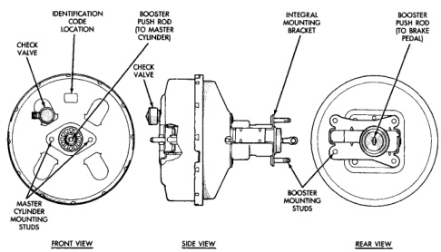

# BRAKES 5-3

## DESCRIPTION AND OPERATION (Continued)

*Fig. 1 Power Brake Booster*
- Identification Code Location
- Check Valve
- Master Cylinder Mounting Studs
- Booster Push Rod (to Master Cylinder)
- Check Valve
- Integral Mounting Bracket
- Booster Mounting Studs
- Booster Push Rod (to Brake Pedal)
- Front View
- Side View
- Rear View

Booster I.D. code letters are as follows:

- 1/2 ton booster code: ZK
- 3/4 and 1 ton booster code: ZL

The only serviceable power brake booster components are the vacuum hose and check valve. The booster itself is not a repairable component. The booster must be replaced as an assembly whenever diagnosis indicates a fault has occurred.

### VACUUM BRAKE BOOSTER OPERATION

The booster assembly consists of a housing divided into separate chambers by two internal diaphragms. The outer edge of each diaphragm is attached to the booster housing. The diaphragms are in turn, connected to the booster push rod.

Two push rods are used to operate the booster. One push rod connects the booster to the brake pedal. The second push rod (at the forward end of the housing), strokes the master cylinder pistons. The rear push rod is connected to the two diaphragms in the booster housing.

The atmospheric inlet valve is opened and closed by the push rod connected to the brake pedal. The booster vacuum supply is through a hose attached to a fitting on the intake manifold. The hose is connected to a vacuum check valve in the booster housing. The check valve is a one-way device that prevents vacuum leak back.

Power assist is generated by utilizing the pressure differential between normal atmospheric pressure and a vacuum. The vacuum needed for booster operation is taken directly from the engine intake manifold. The entry point for atmospheric pressure is through an inlet valve at the rear of the housing.

The forward portion of the booster housing (area in front of the two diaphragms), is exposed to manifold vacuum. The rear portion (area behind the diaphragms), is also under vacuum, but less vacuum than the forward portion.

Pressing the brake pedal causes the rear push rod to open the inlet valve. This exposes the area behind the diaphragms to atmospheric pressure. The resulting force applied to the diaphragms is what provides the extra boost in apply pressure for power assist. Pressure differential creates force imbalance and provides boost.

### HYDRAULIC BRAKE BOOSTER

Vehicles equipped with a Hydraulic Booster (Fig. 2) use the booster to supply power assist to the brake system. The booster is mounted to the front cowl
