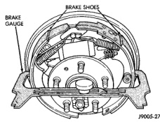
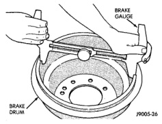
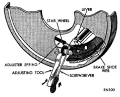

# BRAKES 5-40

## ADJUSTMENTS (Continued)

*Fig. 84 Adjusting Gauge On Drum*
- Brake Gauge
- Brake Drum

*Fig. 83 Adjusting Gauge On Brake Shoes*
- Brake Shoes
- Brake Gauge

6. Pull shoe adjuster lever away from adjuster screw star wheel.

7. Turn adjuster screw star wheel (by hand) to expand or retract brake shoes. Continue adjustment until gauge outside legs are light drag-fit on shoes.

8. Install brake drums and wheels and lower vehicle.

9. Drive vehicle and make one forward stop followed by one reverse stop. Repeat procedure 8-10 times to operate automatic adjusters and equalize adjustment.

> **NOTE:** Bring vehicle to complete standstill at each stop. Incomplete, rolling stops will not activate automatic adjusters.

**ADJUSTMENT WITH ADJUSTING TOOL**

1. Be sure parking brake lever is fully released.

2. Raise vehicle so rear wheels can be rotated freely.

3. Remove plug from each access hole in brake support plates.

4. Loosen parking brake cable adjustment nut until there is slack in front cable.

5. Insert adjusting tool through support plate access hole and engage tool in teeth of adjusting screw star wheel (Fig. 85).

*Fig. 85 Brake Adjustment*
- Lever
- Star Wheel
- Adjusting Tool
- Screwdriver
- Adjuster Spring
- Brake Shoe Web

6. Rotate adjuster screw star wheel (move tool handle upward) until slight drag can be felt when wheel is rotated.

7. Push and hold adjuster lever away from star wheel with thin screwdriver.

8. Back off adjuster screw star wheel until brake drag is eliminated.

9. Repeat adjustment at opposite wheel. Be sure adjustment is equal at both wheels.

10. Install support plate access hole plugs.

11. Adjust parking brake cable and lower vehicle.

12. Install brake drums and wheels and lower vehicle.

13. Drive vehicle and make one forward stop followed by one reverse stop. Repeat procedure 8-10 times to operate automatic adjusters and equalize adjustment.

> **NOTE:** Bring vehicle to complete standstill at each stop. Incomplete, rolling stops will not activate automatic adjusters.

---

### PARKING BRAKE CABLE TENSIONER

> **NOTE:** Tensioner adjustment is only necessary when the tensioner, or a cable has been replaced or disconnected for service. When adjustment is necessary, perform adjustment only as described in the following procedure. This is necessary to avoid faulty parking brake operation.

1. Raise vehicle.
