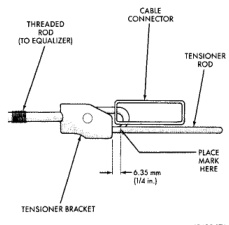

# BRAKES 5-41

## ADJUSTMENTS (Continued)

2. Back off cable tensioner adjusting nut to create slack in cables.
3. Remove rear wheel and tire assemblies. Then remove brake drums.
4. Check rear brake shoe adjustment with standard brake gauge.
5. Replace worn brake shoes if necessary.
6. Verify parking brake cables operate freely. Replace faulty cables if necessary.
7. Install drums and verify that drums rotate freely without drag.
8. Install wheel/tire assemblies.
9. Lower vehicle enough for access to parking brake foot pedal.
10. Fully apply parking brakes and leave brakes applied until adjustment is complete.
11. Raise vehicle again.
12. Mark tensioner rod 6.5 mm (1/4 in.) from edge of tensioner bracket (Fig. 86).
13. Tighten adjusting nut at equalizer until mark on tensioner rod moves into alignment with tensioner bracket (Fig. 86).

> **CAUTION:** Do not loosen, or tighten the tensioner adjusting nut for any reason after completing adjustment.

14. Release parking brake and verify rear wheels rotate freely without drag. Then lower vehicle.

*Fig. 86 Adjustment Mark On Cable Tensioner Rod*
- Threaded Rod (to Equalizer)
- Cable Connector
- Tensioner Rod
- Place Mark Here 6.35 mm (1/4 in.)
- Tensioner Bracket

---

## SPECIFICATIONS

### BRAKE FLUID

The brake fluid used in this vehicle must conform to DOT 3 specifications and SAE J1703 standards. No other type of brake fluid is recommended or approved for usage in the vehicle brake system. Use only Mopar brake fluid or an equivalent from a tightly sealed container.

> **CAUTION:** Never use reclaimed brake fluid or fluid from a container which has been left open. An open container will absorb moisture from the air and contaminate the fluid.

> **CAUTION:** Never use any type of a petroleum-based fluid in the brake hydraulic system. Use of such type fluids will result in seal damage of the vehicle brake hydraulic system causing a failure of the vehicle brake system. Petroleum based fluids would be items such as engine oil, transmission fluid, power steering fluid etc.

### BASE BRAKE

**Disc Brake Caliper**

| Specification | Value |
|---------------|-------|
| Type | Sliding |
| **Caliper Piston Diameter** | |
| 1500 | 75 mm (2.95 in.) |
| 2500 | 80 mm (3.14 in.) |
| 3500 | 86 mm (3.38 in.) |

**Disc Brake Rotor**

| Specification | Value |
|---------------|-------|
| **Rotor Size** | |
| 1500 | 294×32 mm (11.57×1.26 in.) |
| 2500 | 317.5×38 mm (12.5×1.5 in.) |
| 3500 | 317.5×38 mm (12.5×1.5 in.) |
| Max. Runout | 0.127 mm (0.005 in.) |
| Max. Thickness Variation | 0.025 mm (0.001 in.) |
| **Minimum Rotor Thickness** | |
| 1500 4X2 | 30.86 mm (1.215 in.) |
| 1500 4X4 | 32.23 mm (1.2689 in.) |
| 2500 4X2 | 32.24 mm (1.2693 in.) |
| 2500 4X4 LD | 32.24 mm (1.2693 in.) |
| 2500 4X4 HD | 38.64 mm (1.5213 in.) |
| 3500 4X2 | 38.56 mm (1.5182 in.) |
| 3500 4X4 | 38.64 mm (1.5213 in.) |

**Drum Brake**

| Specification | Value |
|---------------|-------|
| **Drum Size** | |
| 1500 | 279×51 mm (11×2 in.) |
| 2500 | 330×63.5 mm (13×2.5 in.) |
| 3500 | 330×89 mm (13×3.5 in.) |
| Max. Runout | 0.20 mm (0.008 in.) |
| Max. Thickness Variation | 0.076 mm (0.003 in.) |

**Wheel Cylinder Bore Size**

| Model | Size |
|-------|------|
| 1500 | 23.8 mm (0.937 in.) |
| 2500 4x2 | 24 mm (0.944 in.) |
