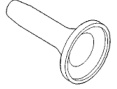
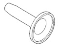
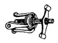
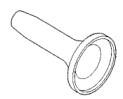
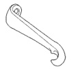

# BRAKES 5-42

## SPECIFICATIONS (Continued)

| Model | Size |
|-------|------|
| 2500 4x4 | 27 mm (1.06 in.) |
| 3500/2500 | 27 mm (1.06 in.) |

**Master Cylinder Bore**

| Specification | Value |
|---------------|-------|
| Size | 31.8 mm (1.25 in.) |

**Brake Boosters**

| Specification | Value |
|---------------|-------|
| Type | Vacuum Dual Diaphragm |
| Type | Hydraulic |

---

## TORQUE CHART

| DESCRIPTION | TORQUE |
|-------------|--------|
| **Booster** | |
| Mounting Nuts | 28 N·m (21 ft. lbs.) |
| **Diesel Hydraulic Booster** | |
| Mounting Bolts | 28 N·m (21 ft. lbs.) |
| Booster Lines | 28 N·m (21 ft. lbs.) |
| Booster Hoses | 31 N·m (23 ft. lbs.) |
| **Master Cylinder** | |
| Mounting Nuts | 28 N·m (21 ft. lbs.) |
| Brake Lines | 19-23 N·m (170-200 in. lbs.) |
| **Combination Valve** | |
| Mounting Bolt | 23 N·m (210 in. lbs.) |
| Brake Lines | 19-200 N·m (170-200 in. lbs.) |
| **Proportioning Valve** | |
| Mounting Nuts | 34 N·m (25 ft. lbs.) |
| Brake Hose | 31 N·m (276 in. lbs.) |
| Brake Lines | 19-200 N·m (170-200 in. lbs.) |
| **Caliper** | |
| Mounting Bolts | 51 N·m (38 ft. lbs.) |
| **Wheel Cylinder** | |
| Mounting Bolts | 20 N·m (15 ft. lbs.) |
| Brake Line | 13 N·m (115 in. lbs.) |
| **Support Plate** | |
| Mounting Bolts | 47-68 N·m (35-50 ft. lbs.) |
| **Park Brake Pedal Assembly** | |
| Mounting Bolts/Nuts | 28 N·m (21 ft. lbs.) |

---

## SPECIAL TOOLS

### BASE BRAKES

*Fig. 1 Installer, Brake Caliper Dust Boot 6753*

*Fig. 2 Installer, Brake Caliper Dust Boot 6754*

*Fig. 3 Installer, Brake Caliper Dust Boot 6755*

*Fig. 4 Puller, Hub/Bearing C-844*

*Fig. 5 Puller Leg C-844-1*
