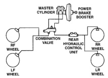
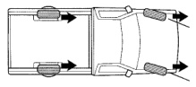

# BRAKES 5-44

## DESCRIPTION AND OPERATION (Continued)

### HYDRAULIC PRESSURE

The RWAL system controls hydraulic pressure to both rear wheels simultaneously, not each one independently. If one rear wheel starts to decelerate too rapidly, the RWAL system affects the hydraulic pressure to both rear brakes (Fig. 1).

*Fig. 1 RWAL Hydraulic Circuit*
- Master Cylinder
- Power Brake Booster
- Combination Valve
- Rear Hydraulic Control Unit
- RF Wheel
- LF Wheel
- RR Wheel
- LR Wheel

### DIRECTIONAL STABILITY

The RWAL system operates on the rear wheels only, it is possible to lock the front wheels of the vehicle during a high deceleration stop. In this event, the vehicle will be stable, but the driver will be unable to alter the direction of the vehicle with the steering wheel (Fig. 2).

*Fig. 2 Directional Stability*

### STOPPING DISTANCE

The RWAL brake system limits wheel slip to approximately 20%. This provides for maximum brake effectiveness. Wheel slip means how well the tires grip the road surface. With light or no braking there is no wheel slip. With the wheels locked (not rotating) during a panic stop, there is 100% wheel slip. To obtain the shortest stopping distance and the greatest control over the vehicle during heavy braking, approximately 20% wheel slip is most efficient, under most conditions.

### PEDAL FEEL

The brake pedal feel is similar to that of a conventional brake system. Under certain conditions the pedal may drop slightly when there is a need for pressure increase during a long antilock stop. The sequence of antilock events is to isolate, decrease, and then increase pressure to maintain brake effectiveness. When the system is in the increase mode is when the pedal will drop slightly.

### TIRE NOISE

The RWAL system prevents complete rear wheel lock-up, but some wheel slip is desired to obtain optimum braking performance. During brake pressure modulation brake pressure is increased and wheel slip controlled by the CAB is allowed to reach up to approximately 20%. This means that the wheel rolling speed is approximately 20% less than that of a free rolling wheel at any given vehicle speed. The wheel slip may result in some tire "chirping", depending upon the road surface. This sound should not be interpreted as a total wheel lock-up and can be considered normal under most conditions.

### BRAKE PEDAL

During antilock braking, the RWAL valve cycles rapidly in response to CAB inputs. The driver may experience a pulsing sensation in the brake pedal and vehicle as the valves modulate brake fluid pressure as needed. Brake pedal and vehicle pulsations during an antilock stop should be considered as normal.
