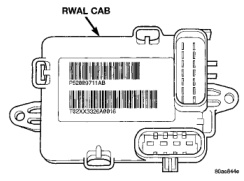

# BRAKES 5-45

## DESCRIPTION AND OPERATION (Continued)

### RWAL COMPONENT LOCATION

| COMPONENT | LOCATION | FUNCTION |
|-----------|----------|----------|
| Controller Antilock Brake | Driver side inner fender on a bracket. | Tests, monitors and controls the rear brake system. |
| Hydraulic Control Unit/RWAL Valve | Driver side inner fender on a bracket. | Modulates hydraulic pressure to rear brakes during an ABS stop. |
| Rear Wheel Speed Sensor | Top of the rear axle housing. | Sends an AC voltage sinewave to the CAB whose frequency is proportional to vehicle speed. |
| Exciter Ring | Ring gear inside the differential housing. | Used to pull the magnetic field across the wheel speed sensor's windings. |
| Red Brake Warning Lamp | Instrument cluster. | Indicator for park brake engagement, hydraulic brake malfunction, or ABS malfunction. |
| Amber ABS Warning Lamp | Instrument cluster. | Indicator of an ABS malfunction. |
| Brake Warning Lamp Diode | Instrument panel harness near the parking brake switch. | Isolates the park brake switch circuit from the CAB for proper red brake warning lamp operation. |
| Isolation And Dump Valve Fuse | Inside the CAB. | Fail-safe device for unwanted control of the isolation and dump solenoid/valves. |
| Isolation And Dump Solenoid/Valves | Inside the HCU/RWAL valve. | Used to modulate hydraulic pressure to the rear brakes during an ABS stop. |

### CONTROLLER ANTILOCK BRAKES

The Controller Antilock Brakes (CAB) is a microprocessor which handles testing, monitoring and controlling the ABS brake system operation (Fig. 3). The CAB functions are:

- Perform self-test diagnostics.
- Monitors the RWAL brake system for proper operation.
- Controls the RWAL valve solenoids.

*Fig. 3 RWAL CAB*

> **NOTE:** If the CAB needs to be replaced, the rear axle type and tire revolutions per mile must be programed into the new CAB. For axle type refer to Group 3 Differential and Driveline. For tire revolutions per mile refer to Group 22 Tire and Wheels. To program the CAB refer to the Chassis Diagnostic Manual.

### SYSTEM SELF-TEST

When the ignition switch is turned-on the microprocessor RAM and ROM are tested. If an error occurs during the test a DTC will be set into the RAM memory. However it is possible the DTC will not be stored in memory if the error has occurred in the RAM module were the DTC's are stored. Also it is possible a DTC may not be stored if the error has occurred in the ROM which signals the RAM to store the DTC.

### CAB INPUTS

The CAB continuously monitors the speed of the differential ring gear by monitoring signals generated by the rear wheel speed sensor. The CAB determines a wheel locking tendency when it recognizes the ring gear decelerating too rapidly. The CAB monitors the
