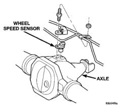
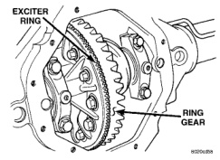

# BRAKES 5-46

## DESCRIPTION AND OPERATION (Continued)

following inputs to determine when a wheel locking tendency may exists:

- Rear Wheel Speed Sensor
- Brake Lamp Switch
- Brake Warning Lamp Switch
- Reset Switch
- 4WD Switch (If equipped)

### CAB OUTPUTS

The CAB controls the following outputs for antilock braking and brake warning information:

- RWAL Valve
- ABS Warning Lamp
- Brake Warning Lamp

### RWAL VALVE

If the CAB senses that rear wheel speed deceleration is excessive, it will energize a isolation solenoid by providing battery voltage to the solenoid. This prevents a further increase of driver induced brake pressure to the rear wheels. If this initial action is not enough to prevent rear wheel lock-up, the CAB will momentarily energize a dump solenoid (the CAB energizes the dump solenoid by providing battery voltage to the solenoid). This opens the dump valve to vent a small amount of isolated rear brake pressure to an accumulator. The action of fluid moving to the accumulator reduces the isolated brake pressure at the wheel cylinders. The dump (pressure venting) cycle is limited to very short time periods (milliseconds). The CAB will pulse the dump valve until rear wheel deceleration matches the vehicle deceleration rate or the desired slip rate programmed into the CAB. The system will switch to normal braking once wheel locking tendencies are no longer present.

A predetermined maximum number of consecutive dump cycles can be performed during any one antilock stop. If excessive dump cycles occur, a DTC will be set and stored in the CAB memory. If during an antilock stop, the driver releases the brake pedal, the reset switch contacts will open. This signal to the CAB is an indication that pressure has equalized across the RWAL valve. The CAB will then reset the dump cycle counter in anticipation of the next antilock stop. Additionally, any fluid stored in the accumulator will force its way past the dump valve, back into the hydraulic circuit and return to the master cylinder.

A fuse internal to the CAB, provides a fail-safe device which prevents unwanted control over the isolation and dump solenoids. The fuse is in series with the isolation and dump solenoids output circuits. If the internal fuse is open, the CAB cannot provide voltage to energize either solenoid and antilock stops are prevented. If the fuse is open, the braking system will operate normally but without antilock control over rear brake pressure.

### REAR WHEEL SPEED SENSOR AND EXCITER RING

The rear Wheel Speed Sensor (WSS) is mounted in the rear differential housing (Fig. 4). The WSS consists of a magnet surrounded by windings from a single strand of wire. The sensor sends a small AC signal to the CAB. This signal is generated by magnetic induction. The magnetic induction is created when a toothed sensor ring (exciter ring or tone wheel) passes the stationary magnetic WSS.

*Fig. 4 Rear Wheel Speed Sensor Location*
- Wheel Speed Sensor
- Axle

The exciter ring is press fitted onto the differential carrier next to the final drive ring gear (Fig. 5). For replacement procedure of the exciter ring, refer to Group 3 Differential and Driveline.

*Fig. 5 Exciter Ring Location*
- Exciter Ring
- Ring Gear

When the ring gear is rotated, the exciter ring passes the tip of the WSS. As the exciter ring passes the tip of the WSS, the magnetic lines of force of the sensor are cut, causing the magnetic field to be moved across the sensor's windings. This, in turn
