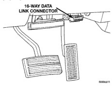
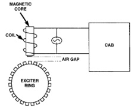

# BRAKES 5-47

## DESCRIPTION AND OPERATION (Continued)

causes current to flow through the WSS circuit (Fig. 6). Every time a tooth of the exciter ring passes the tip of the WSS, an AC signal is generated. Each AC signal (positive to negative signal or sinewave) is interpreted by the CAB. It then compares the frequency of the sinewave to a time value to calculate vehicle speed. The CAB continues to monitor the frequency to determine a deceleration rate that would indicate a possible wheel-locking tendency.

*Fig. 7 Operation of the Wheel Speed Sensor*
- Magnetic Core
- Coil
- Air Gap
- Exciter Ring
- CAB

The signal strength of any magnetic induction sensor is directly affected by:

- Magnetic field strength; the stronger the magnetic field, the stronger the signal
- Number of windings in the sensor; more windings provide a stronger signal
- Exciter ring speed; the faster the exciter ring rotates, the stronger the signal will be
- Distance between the exciter ring teeth and WSS; the closer the WSS is to the exciter ring, the stronger the signal will be

The rear WSS is not adjustable. A clearance specification has been established for manufacturing tolerances. If the clearance is not within these specifications, then either the WSS or other components may be damaged. The clearance between the WSS and the exciter ring is 0.005 - 0.050 in.

The assembly plant performs a "Rolls Test" on every vehicle that leaves the assembly plant. One of the test performed is a test of the WSS. To properly test the sensor, the assembly plant connects test equipment to the Data Link Connector (DLC). This connector is located to the right of the steering column and attached to the lower portion of the instrument panel (Fig. 7). The rolls test terminal is spliced to the WSS circuit. The vehicle is then driven on a set of rollers and the WSS output is monitored for proper operation.

*Fig. 8 Data Link Connector - Typical*
- 16-Way Data Link Connector

### BRAKE WARNING LAMPS

**RED WARNING LAMP**

The red brake warning lamp is used to alert the driver of a hydraulic fault or that the parking brake is applied. For the RWAL system, the red brake warning lamp also is used to alerts the driver of a problem with the RWAL system.

The brake warning lamp illuminates when ignition voltage is supplied to the bulb and a ground is provided for the bulb. The bulb has ignition voltage supplied to it any time the ignition switch is in the RUN or START positions. A ground for the bulb is provided when:

- The ignition switch is turned to the START position.
- The parking brakes are applied and the park brake switch is actuated.
- A hydraulic fault has occurred and the pressure differential switch is actuated.
- A RWAL fault has occurred.

**ABS WARNING LAMP**

The amber ABS warning lamp is used to alerts the driver of RWAL problem and identify DTCs stored in the CABs memory.

The ABS warning lamp illuminates when ignition voltage is supplied to the bulb and a ground is provided for the bulb. The bulb has ignition voltage supplied to it anytime the ignition switch is in the RUN or START positions. A ground for the bulb is provided by the CAB only. A circuit in the CAB monitors the brake warning lamp switch and the ignition switch bulb check circuit (grounds the brake warning lamp bulb during the START position). When the CAB
