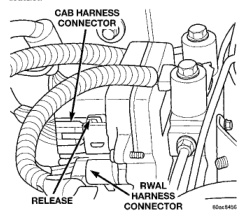
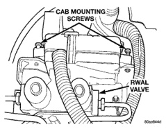
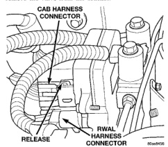

# BRAKES 5-49

## SERVICE PROCEDURES (Continued)

Do not pressure bleed without a proper master cylinder adapter. The wrong adapter can lead to leakage, or drawing air back into the system.

---

## REMOVAL AND INSTALLATION

### CONTROLLER

> **NOTE:** If the CAB needs to be replaced, the rear axle type and tire revolutions per mile must be programed into the new CAB. For axle type refer to Group 3 Differential and Driveline. For tire revolutions per mile refer to Group 22 Tire and Wheels. To program the CAB refer to the Chassis Diagnostic Manual.

**REMOVAL**

1. Pull up on the CAB harness connector lock release and remove the connector (Fig. 8) from the controller.

2. Remove the RWAL valve harness connector (Fig. 8) from the controller.

3. Remove the controller mounting screws (Fig. 9) and remove the controller from the mounting bracket.

*Fig. 9 CAB Harness Connections*
- CAB Harness Connector
- Release
- RWAL Harness Connector

*Fig. 8 CAB Mounting Screws*
- CAB Mounting Screws
- RWAL Valve

**INSTALLATION**

1. Position the controller on the bracket and install the mounting screws. Tighten the screws to 2.5-3.5 N·m (22-31 in. lbs.).

2. Install the RWAL valve harness connector into the controller.

3. Install the CAB harness connector into the controller and push down on the connector lock.

### RWAL VALVE

**REMOVAL**

1. Remove RWAL valve harness connector (Fig. 10) from the RWAL controller.

2. Remove the brake lines from the valve.

3. Remove the valve mounting bolt (Fig. 11) and remove the valve from the bracket.

*Fig. 10 RWAL Valve Harness Connector*
- CAB Harness Connector
- Release
- RWAL Harness Connector

**INSTALLATION**

1. Position the valve on the bracket and install the mounting bolt. Tighten the mounting bolt to 20-27 N·m (180-240 in. lbs.).

2. Install the brake lines and tighten to 19-23 N·m (170-200 in. lbs.).

3. Install the RWAL valve harness connector into the RWAL controller.

4. Bleed the brake system.
