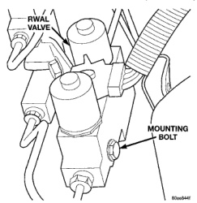
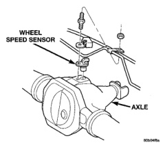

# BRAKES 5-50

## REMOVAL AND INSTALLATION (Continued)

*Fig. 11 RWAL Valve*
- RWAL Valve
- Mounting Bolt

### REAR WHEEL SPEED SENSOR

**REMOVAL**

1. Raise vehicle on hoist.

2. Remove brake line mounting nut and remove the brake line from the sensor stud.

3. Remove mounting stud from the sensor and shield (Fig. 12).

4. Remove sensor and shield from differential housing.

5. Disconnect sensor wire harness and remove sensor.

**INSTALLATION**

1. Connect harness to sensor. **Be sure seal is securely in place between sensor and wiring connector.**

2. Install O-ring on sensor (if removed).

3. Insert sensor in differential housing.

4. Install sensor shield.

5. Install the sensor mounting stud and tighten to 24 N·m (18 ft. lbs.).

*Fig. 12 Rear Speed Sensor Mounting*
- Wheel Speed Sensor
- Axle

6. Install the brake line on the sensor stud and install the nut.

7. Lower vehicle.

### EXCITER RING

The exciter ring is mounted on the differential case. If the ring is damaged refer to Group 3 Differential and Driveline for service procedures.

---

## SPECIFICATIONS

### TORQUE CHART

| DESCRIPTION | TORQUE |
|-------------|--------|
| **Controller** | |
| Mounting Screws | 2.5-3.5 N·m (22-31 in. lbs.) |
| **RWAL Valve** | |
| Mounting Bolt | 20-27 N·m (180-240 in. lbs.) |
| Brake Line Fittings | 19-23 N·m (170-200 in. lbs.) |
| **Wheel Speed Sensor** | |
| Mounting Bolt | 24 N·m (18 ft. lbs.) |
