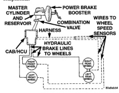

# BRAKES 5-51

## FOUR WHEEL ANTILOCK BRAKE SYSTEM

### INDEX

| GENERAL INFORMATION | PAGE |
|---------------------|------|
| Antilock Brake System | 51 |

| DESCRIPTION AND OPERATION | PAGE |
|---------------------------|------|
| ABS Warning Lamp | 53 |
| Antilock Brake System | 51 |
| Controller Antilock Brakes | 52 |
| Hydraulic Control Unit | 52 |
| Wheel Speed Sensor | 53 |

| DIAGNOSIS AND TESTING | PAGE |
|-----------------------|------|
| Antilock Brakes | 53 |

| SERVICE PROCEDURES | PAGE |
|--------------------|------|
| Bleeding ABS Brake System | 53 |

| REMOVAL AND INSTALLATION | PAGE |
|--------------------------|------|
| Antilock Control Assembly | 54 |
| Controller Antilock Brakes | 54 |
| Exciter Ring | 56 |
| Front Wheel Speed Sensor - 2WD | 55 |
| Front Wheel Speed Sensor - 4WD | 55 |
| Rear Wheel Speed Sensor | 56 |
| Tone Wheel | 56 |

| SPECIFICATIONS | PAGE |
|----------------|------|
| Torque Chart | 56 |

---

## GENERAL INFORMATION

### ANTILOCK BRAKE SYSTEM

The antilock brake system (ABS) is an electronically operated, all wheel brake control system.

The system is designed to prevent wheel lockup and maintain steering control during periods of high wheel slip when braking. Preventing lockup is accomplished by modulating fluid pressure to the wheel brake units.

The hydraulic system is a three channel design. The front wheel brakes are controlled individually and the rear wheel brakes in tandem (Fig. 1). The ABS electrical system is separate from other electrical circuits in the vehicle. A specially programmed controller antilock brake unit operates the system components.

*Fig. 1 Antilock Brake System*
- Master Cylinder And Reservoir
- Power Brake Booster
- Harness
- Combination Valve
- Wires To Wheel Speed Sensors
- CAB/HCU
- Hydraulic Brake Lines To Wheels

ABS system major components include:

- Controller Antilock Brakes (CAB)
- Hydraulic Control Unit (HCU)
- Wheel Speed Sensors (WSS)
- ABS Warning Light

---

## DESCRIPTION AND OPERATION

### ANTILOCK BRAKE SYSTEM

Battery voltage is supplied to the CAB ignition terminal when the ignition switch is turned to Run position. The CAB performs a system initialization procedure at this point. Initialization consists of a static and dynamic self check of system electrical components.

The static and dynamic checks occurs at ignition start up. During the dynamic check, the CAB briefly cycles the pump and solenoids to verify operation. An audible noise may be heard during this self check. This noise should be considered normal.

If an ABS component exhibits a fault during initialization, the CAB illuminates the amber warning light and registers a fault code in the microprocessor memory.

The CAB monitors wheel speed sensor inputs continuously while the vehicle is in motion. However, the CAB will not activate any ABS components as long as sensor inputs indicate normal braking.

### NORMAL BRAKING

During normal braking, the master cylinder, power booster and wheel brake units all function as they would in a vehicle without ABS. The HCU components are not activated.
