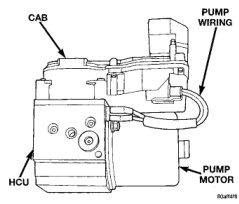

# BRAKES 5-52

## DESCRIPTION AND OPERATION (Continued)

### ANTILOCK BRAKING

The purpose of the antilock system is to prevent wheel lockup during periods of high wheel slip. Preventing lockup helps maintain vehicle braking action and steering control.

The antilock CAB activates the system whenever sensor signals indicate periods of high wheel slip. High wheel slip can be described as the point where wheel rotation begins approaching 20 to 30 percent of actual vehicle speed during braking. Periods of high wheel slip occur when brake stops involve high pedal pressure and rate of vehicle deceleration.

The antilock system prevents lockup during high slip conditions by modulating fluid apply pressure to the wheel brake units.

Brake fluid apply pressure is modulated according to wheel speed, degree of slip and rate of deceleration. A sensor at each wheel converts wheel speed into electrical signals. These signals are transmitted to the CAB for processing and determination of wheel slip and deceleration rate.

The ABS system has three fluid pressure control channels. The front brakes are controlled separately and the rear brakes in tandem. A speed sensor input signal indicating a high slip condition activates the CAB antilock program.

Two solenoid valves are used in each antilock control channel. The valves are all located within the HCU valve body and work in pairs to either increase, hold, or decrease apply pressure as needed in the individual control channels.

The solenoid valves are not static during antilock braking. They are cycled continuously to modulate pressure. Solenoid cycle time in antilock mode can be measured in milliseconds.

### CONTROLLER ANTILOCK BRAKES

The CAB is mounted on the top of the hydraulic control unit (Fig. 2).

The CAB operates the ABS system and is separate from other vehicle electrical circuits. CAB voltage source is through the ignition switch in the RUN position.

The CAB contains dual microprocessors. A logic block in each microprocessor receives identical sensor signals. These signals are processed and compared simultaneously.

The CAB contains a self check program that illuminates the ABS warning light when a system fault is detected. Faults are stored in a diagnostic program memory and are accessible with the DRB scan tool.

ABS faults remain in memory until cleared, or until after the vehicle is started approximately 50 times. Stored faults are **not** erased if the battery is disconnected.

*Fig. 2 CAB/HCU*
- CAB
- Pump Wiring
- Pump Motor
- HCU

> **NOTE:** If the CAB needs to be replaced, the rear axle type and tire revolutions per mile must be programed into the new CAB. For axle type refer to Group 3 Differential and Driveline. For tire revolutions per mile refer to Group 22 Tire and Wheels. To program the CAB refer to the Chassis Diagnostic Manual.

### HYDRAULIC CONTROL UNIT

The hydraulic control unit (HCU) consists of a valve body, pump, accumulator and motor (Fig. 2).

The pump, motor, and accumulator are combined into an assembly attached to the valve body. The accumulator stores the extra fluid which had to be dumped from the brakes. This is done to prevent the wheels from locking up. The pump provides the fluid volume needed and is operated by a DC type motor. The motor is controlled by the CAB.

The valve body contains the solenoid valves. The valves modulate brake pressure during antilock braking and are controlled by the CAB.

The HCU provides three channel pressure control to the front and rear brakes. One channel controls the rear wheel brakes in tandem. The two remaining channels control the front wheel brakes individually.

During antilock braking, the solenoid valves are opened and closed as needed. The valves are not static. They are cycled rapidly and continuously to modulate pressure and control wheel slip and deceleration.

During normal braking, the HCU solenoid valves and pump are not activated. The master cylinder and power booster operate the same as a vehicle without an ABS brake system.
